# csv2tsdb_and_preprocessing_v2

## 수정 부분

- __app_get_stop(정차 구간 추출 컨테이너) 추가__
- __app_get_parking(주차 구간 추출 컨테이너) 추가__
- docker-compose.yml 파일에서 environment의 ip 주소, port 번호 입력 부분 제거 및 __links 옵션 추가 하여 전처리 컨테이너와 openTSDB 컨테이너 통신 가능__

## 전체 구조

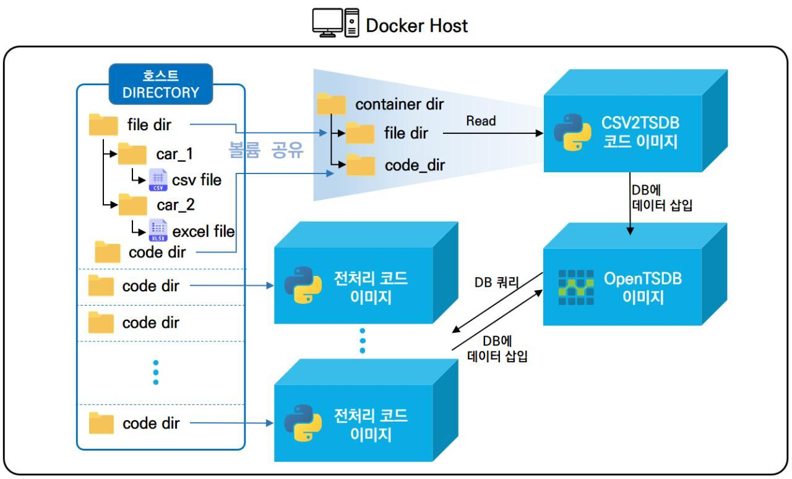

- opentsdb: 컨테이너 실행되어 opentdb 구축
- app_csv_otsdb: host의 원본 CSV file이 저장된 디렉토리를 공유하여 읽어 실행한 opentsdb 컨테이너로 데이터를 put
- app_rm_outlier: opentsdb 컨테이너로부터 주행 데이터를 쿼리 하여 전처리 과정(이상치 제거) 진행 후 opentsdb 컨테이너로 put
- app_get_driving: opentsdb 컨테이너로부터 주행 데이터를 쿼리 하여 주행 구간 추출 및 다시 opentsdb 컨테이너로 put
- app_get_stop: opentsdb 컨테이너로부터 주행 데이터와 주행 구간 데이터를 쿼리 하여 정차 구간 추출 및 다시 opentsdb 컨테이너로 put
- app_get_parking: opentsdb 컨테이너로부터 주행 데이터를 쿼리하여 주차 구간 추출 및 다시 opentsdb 컨테이너로 put


## 사전준비
  1.  docker/docker-compose 설치
      https://hcnam.tistory.com/25
      
  2. 윈도우 docker/docker-compose 설치
      https://steemit.com/kr/@mystarlight/docker

      - 도커 툴박스 설치

        https://github.com/docker/toolbox/releases


## 사용방법
  1. github repo clone 혹은 zip파일 다운로드
  
      - git clone
      
            $ git clone https://github.com/ChulseoungChae/docker-compose.git
        
        or
      
      - 아래링크에서 zip파일 다운로드 후 압축해제, 원하는 디렉토리로 
      
          [Link(https://github.com/ChulseoungChae/docker-compose/releases)](https://github.com/ChulseoungChae/docker-compose/releases)
      
  2. compose 디렉토리 이동 및 docker-compose.yml 파일 수정

        - compose 디렉토리로 이동

              $ cd docker-compose/csv2tsdb_and_preprocessing_v2/compose 

        - docker-compose.yml 파일 수정
          - 기존 docker-compose.yml 의 경우 openTSDB 컨테이너 접근하기 위해 environment 옵션에 ip 주소 및 port 번호 지정,  __v2의 경우 links 옵션을 추가하여 openTSDB컨테이너와 통신 가능하도록 수정 __
            
          - 각 컨테이너 포트 포워딩 포트 및 컨테이너 실행 시 필요한 정보 환경 변수로 지정

            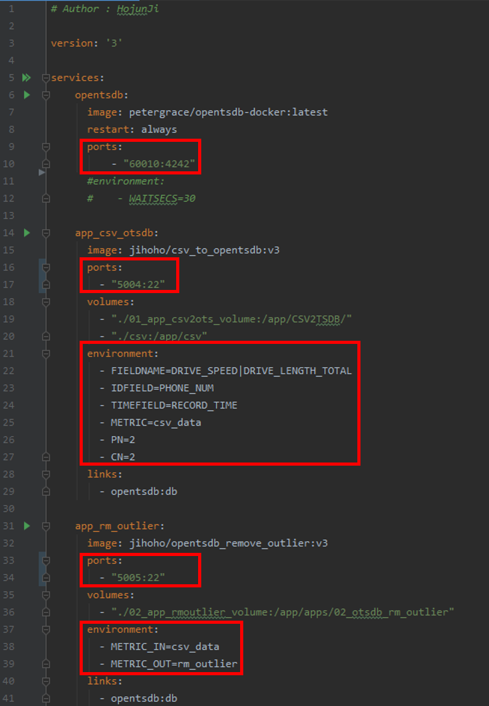
            


  3. opentsdb 컨테이너 실행 및 구동 확인 ( $ docker -compose up -d opentsdb)

    $ docker-compose up -d opentsdb

  - 웹 접속은 docker-compose.yml파일에서 정의한 ip:port로 로컬에서 접속
    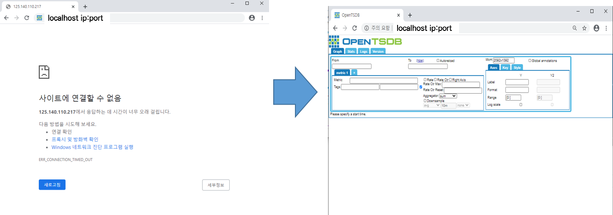

  4. app_csv_otsdb 컨테이너 실행 및 구동 확인

    $ docker-compose up -d app_csv_otsdb

  ※ Window 환경에서 error 발생할 경우 volume directory의 .sh 파일 unix 형식으로 convert
    
    $ dos2unix ./app_csv2ots_volume/* ./app_rmoutlier_volume/* ./app_get_driving_volume/* 

  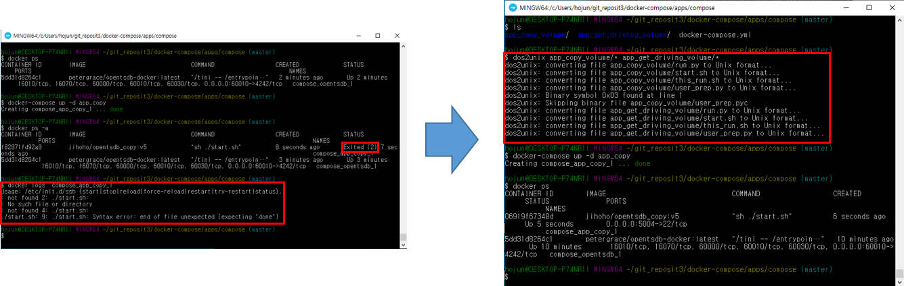


  - opentsdb web 접속 확인(아래 정보 선택 및 입력)

        From : 2020/01/01
        To : 2020/01/08
        Metric : csv_data
        VEHICLE_NUM : 1225797247
        Aggregator: None
      
      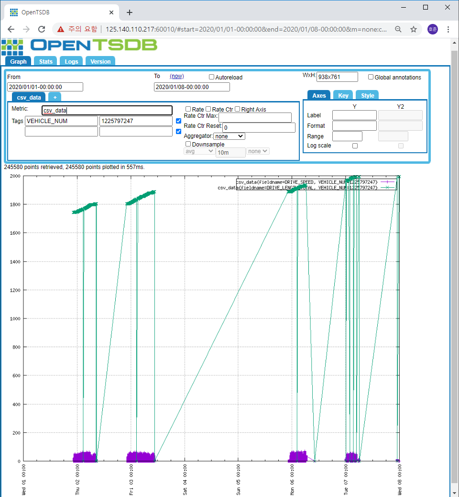
      
  - wget 으로 데이터 입력 여부를 확인할 수 있음

    - <code> 입력 예정 </code>

  5. app_rm_outlier 컨테이너 실행 및 구동 확인

    $ docker-compose up -d app_rm_outlier

  - opentsdb web 접속 확인(아래 정보 선택 및 입력)

        From : 2020/01/01
        To : 2020/01/08
        Metric :  : rm_outlier
        VEHICLE_NUM : 1225797247
        Aggregator: None
      
      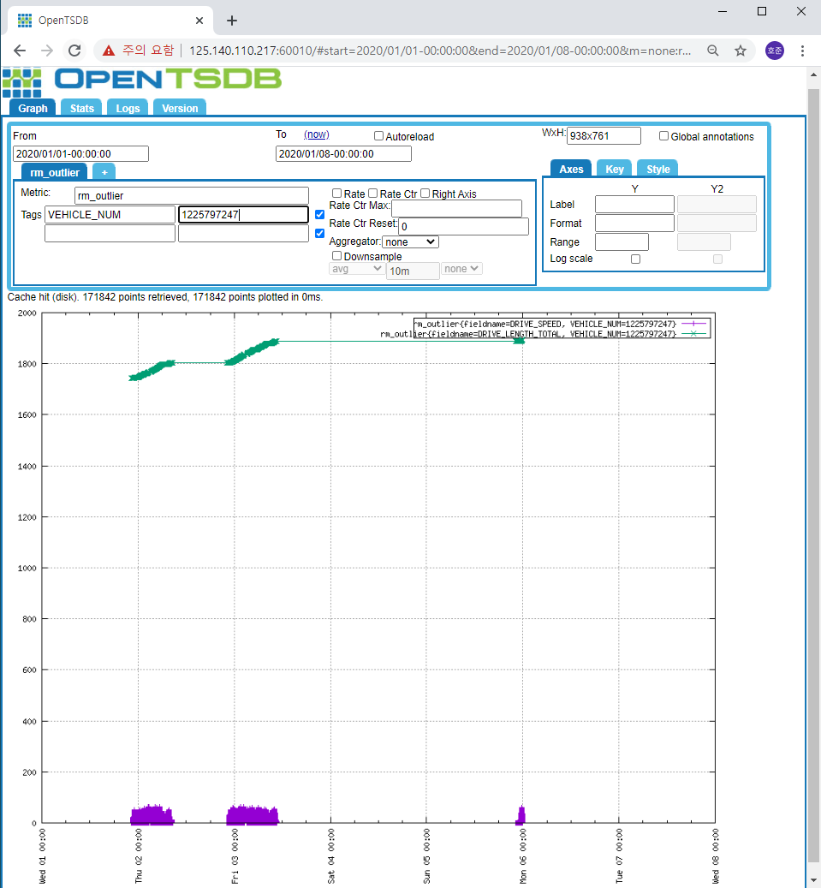

  6. app_get_driving 컨테이너 실행 및 구동 확인

    $ docker-compose up -d app_get_driving

  - opentsdb web 접속 확인(아래 정보 선택 및 입력)

        From : 2020/01/01
        To : 2020/01/08
        Metric : driving_startend
        VEHICLE_NUM : 1225797247
        Aggregator: None
      
      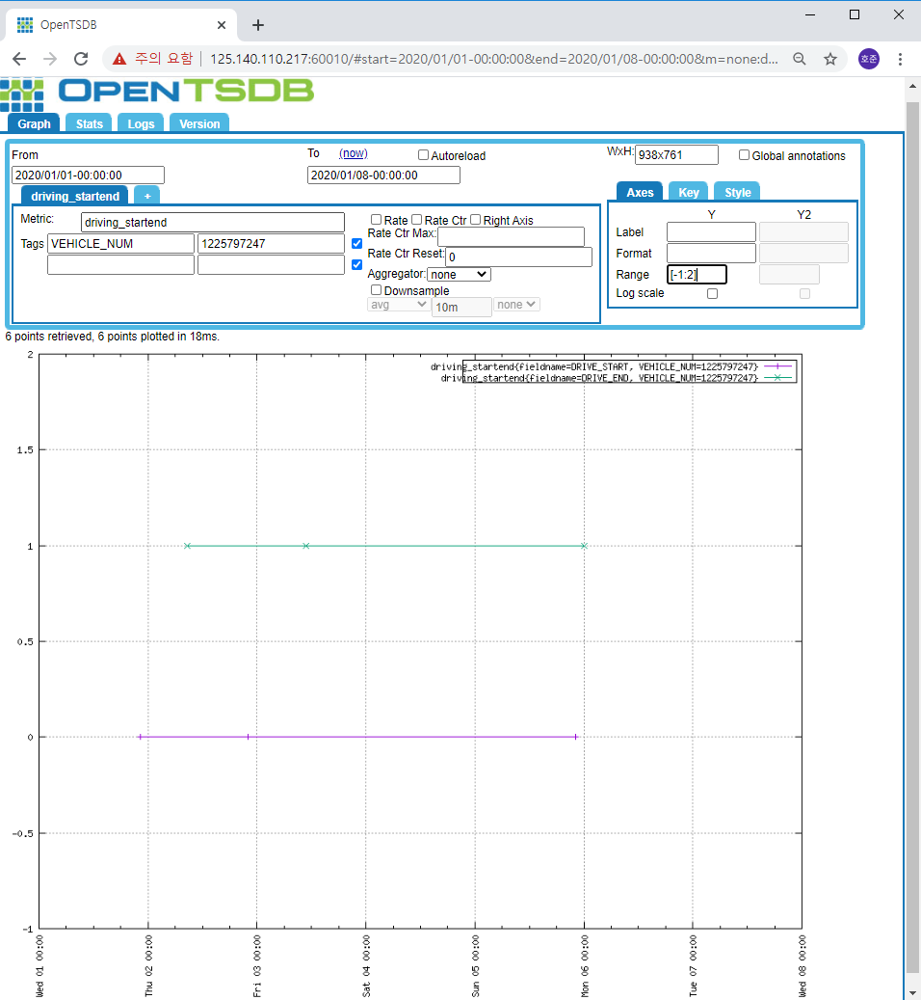

  7. app_get_stop 컨테이너 실행 및 구동 확인

    $ docker-compose up -d app_get_stop

  - opentsdb web 접속 확인(아래 정보 선택 및 입력)

        From : 2020/01/01
        To : 2020/01/08
        Metric : stop_startend
        VEHICLE_NUM : 1225797247
        Aggregator: None
      
      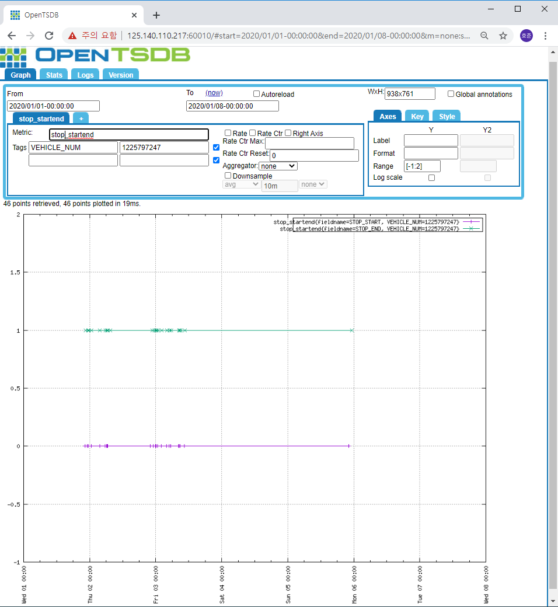

  8. app_get_parking 컨테이너 실행 및 구동 확인

    $ docker-compose up -d app_get_parking

  - opentsdb web 접속 확인(아래 정보 선택 및 입력)

        From : 2020/01/01
        To : 2020/01/08
        Metric : parking_startend
        VEHICLE_NUM : 1225797247
        Aggregator: None
      
      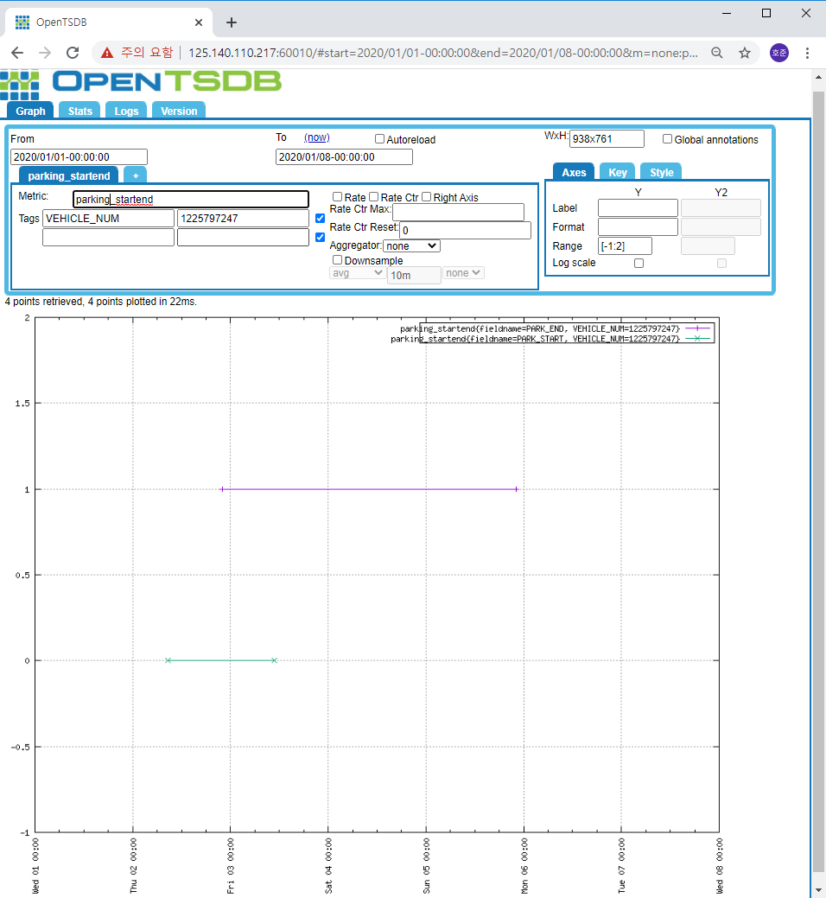

## wget 으로 데이터 입력 여부를 확인

  - opentsdb 웹 접속하여 데이터 조회한 화면

      http://192.168.99.100:60010/#start=2020/01/01-00:00:00&end=2020/01/08-00:00:00&m=none:csv_data&o=&yrange=%5B0:%5D&wxh=938x741&style=linespoint

      

  - 위 화면에서 url의 '#'(드래그한 부분)을 'api/query?' 로 바꾸면 아래 사진과 같이 json형태로 데이터를 확인할 수 있음

      

    이 데이터를 리눅스터미널에서 wget을 이용하여 파일로 내려받을수 있다.

        $ wget 'http://[ip]:[port]/api/query?start=2020/01/01-00:00:00&end=2020/01/08-00:00:00&m=none:[metric name]&o=&yrange=%5B0:%5D&wxh=938x741&style=linespoint' -O filename.txt

  - 테스트 화면
      


## 코드 수정 및 실행

  - 각 컨테이너를 실행시킨 후 원하는 파일을 수정하길 원한다면 다음과 같은 방법으로 수정하고 실행중인 컨테이너에서 전처리 코드만 다시 실행 가능함(ip, port, metric이름과 같은 변수들은 compose에서 입력하도록 하였으나 쿼리 기간 등을 수정하길 원할 때, 혹은 python코드를 수정할 때)

  - 수정 및 실행

    ① 각 컨테이너 볼륨 마운트한 디렉토리로 이동

        ex) $ cd 02_app_rmoutlier_volume/

    ② 수정하려고 하는 파일 편집기로 열기

        ex) vim this_run.sh(윈도우에서는 code editor로 수정 가능)

    ③ 수정 후 실행되고있는 컨테이너 Name 확인

        ex) docker ps –a

    ④ 수정한 코드 실행

        ex) docker exec <컨테이너 name> bash /app/apps/02_otsdb_get_drive_startend/this_run.sh

## 대용량 csv 파일 download

  - 구글 드라이브에서 대용량 csv 파일 다운로드

      From : 2020/01/01
      To : 2020/01/31
     총 데이터 크기 : 1.5G

  - 리눅스 환경

    - 방법 1
      - compose 디렉토리에서 아래의 명령어로 csv 파일 다운로드 및 압축 해제

        ```
        $ sh csv_download.sh
        ```

      - data.tar.gz 압축 해제

        ```
        $ tar -zxvf csv_2.tar.gz
        ```
      
     - 방법2
        - compose 디렉토리에서 아래 명령어로 분할압축된 big_csv.tar파일 압축해제
        
          ```
          $ cat ./big_csv/big_csv.tar* | tar xvf -
          ```

- 윈도우 환경

  - 구글 드라이브 링크 접속 해서 다운로드 및 압축 해제

  ```
  https://drive.google.com/file/d/10F8rkDC6ZLMe4WsdAmM6-h-tSpQpsKsT/view?usp=sharing
  ```

- csv_volume의 기존 csv 파일 제거 후 다운로드 받은 csv 파일 csv_volume 디렉터리로 이동

  ```
  $ rm -r csv_volume/*
  ```

  ```
  $ mv csv_2 csv_volume/
  ```

  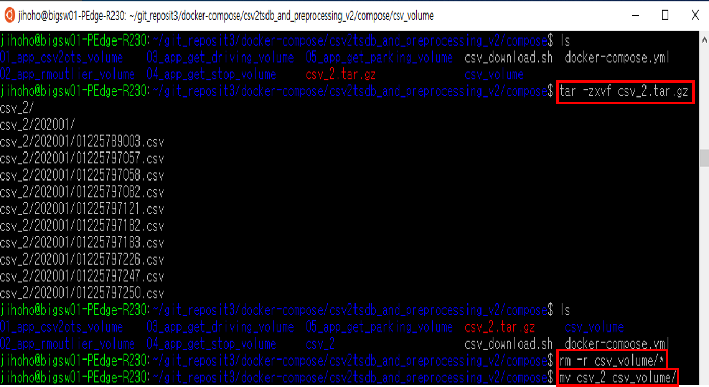

- 코드 수정 및 실행

  - app_csv_otsdb 컨테이너 코드 수정 및 실행

    ① 01_app_csv2ots_volume 디렉토리로 이동

    ```
    $ cd 01_app_csv2ots_volume
    ```

    

    ② this_run.sh 파일에서 CSV 정보 및 openTSDB metric name 수정

    ```
    $ vim this_run.sh(윈도우에서는 code editor로 수정 가능)
    ```

    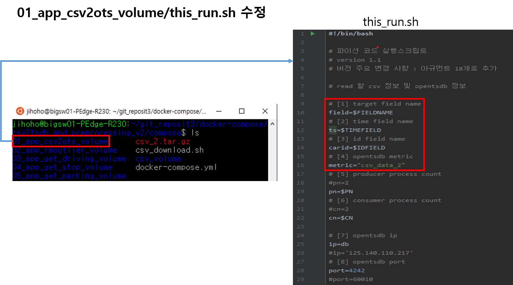

    ③ 실행 되고 있는 컨테이너 네임 확인 후 수정 코드 실행

    ```
    $ docker ps -a
    ```

    ``` 
    $ sudo docker exec <컨테이너 네임> bash /app/CSV2TSDB/this_run.sh
    ```

    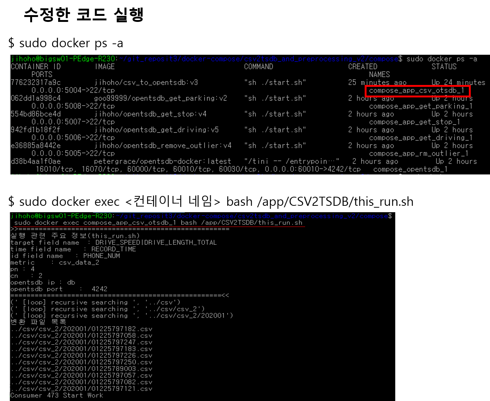 

    ④ openTSDB 웹 접속하여 metric 확인

    opentsdb web 접속 확인(아래 정보 선택 및 입력)

    ```
      From : 2020/01/01
      To : 2020/02/01
      Metric : csv_data_2
      Aggregator: None
    ```

    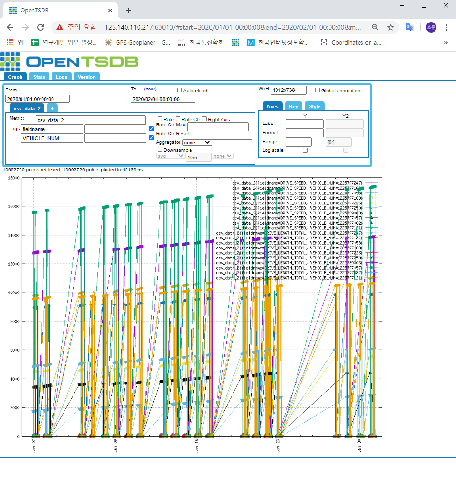

      

    - 전처리 컨테이너 코드 수정 및 실행

      ① 각 컨테이너 볼륨 마운트한 디렉토리로 이동

      ```
      ex) cd 02_app_rmoutlier_volume  #app_rm_outlier 컨테이너 볼륨
      	cd 03_app_get_driving_volume  #app_get_driving 컨테이너 볼륨
      	cd 04_app_get_stop_volume  #app_get_stop 컨테이너 볼륨
      	cd 05_app_get_parking_volume  #app_get_parking 컨테이너 볼륨
      ```

      ② 수정하려고 하는 파일 편집기로 열기

          ex) vim this_run.sh(윈도우에서는 code editor로 수정 가능)

      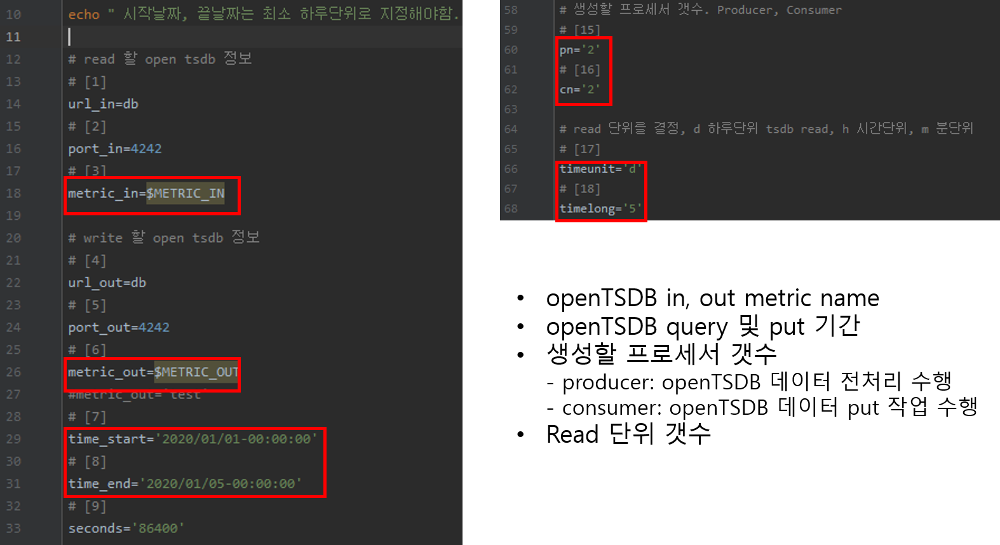

      ③ 수정 후 실행되고있는 컨테이너 Name 확인

          ex) docker ps -a

      ④ 수정한 코드 실행

          # app_rm_outlier 컨테이너 실행 
          $ docker exec <컨테이너 name> bash /app/apps/02_otsdb_rm_outlier/this_run.sh
          
          # app_get_driving 컨테이너 실행 
          $ docker exec <컨테이너 name> bash /app/apps/02_otsdb_get_drive_startend/this_run.sh
          
          # app_get_stop 컨테이너 실행 
          $ docker exec <컨테이너 name> bash /app/apps/otsdb_get_stop/this_run.sh
          
          # app_get_parking 컨테이너 실행 
          $ docker exec <컨테이너 name> bash /app/apps/otsdb_get_parking/this_run.sh

      


## 컨테이너 ssh 접속

    ssh root@[<호스트 ip> or <docker-toolbox ip>] -p <사용자가 지정한 포트번호>
