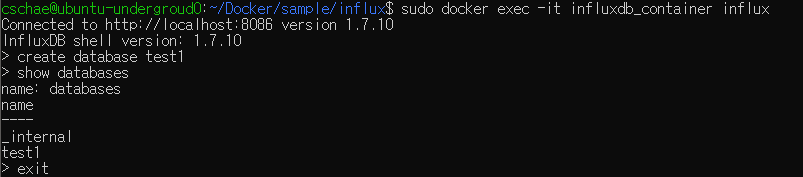
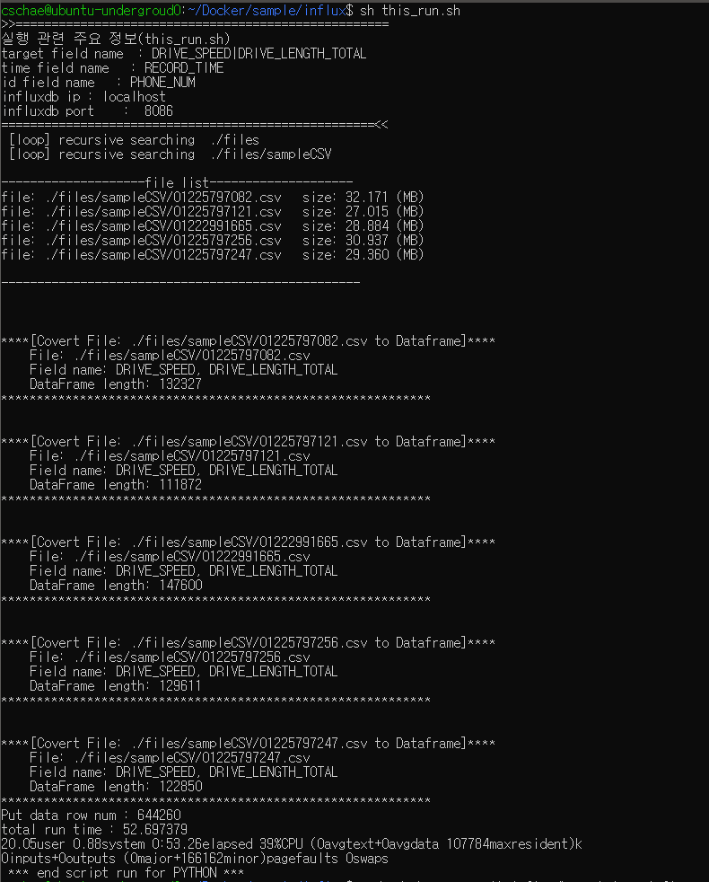
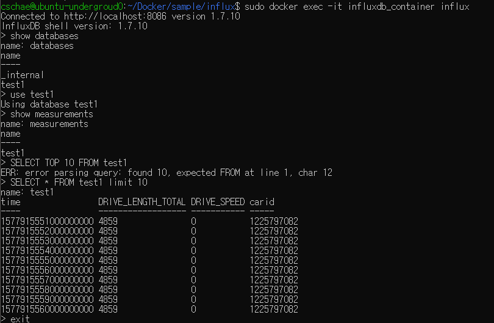

# InfluxDB data read & write test sample Code 


## 전체구조

  

----


## 100만개 이상의 datapoint write & read 동작 테스트 과정

  [](https://asciinema.org/a/9BZtDtsycBZ3aVtPdJ0XB8Vqg)


  1. github repo clone 후 influx docker 실행 디렉토리로 이동
  
      - git clone & compose 디렉토리로 이동
      
          ```
          $ git clone https://github.com/KETI-IISRC/Docker

          $ cd ./Docker/sample/influx
          ```

  2. 대량의 데이터가 저장된 CSV파일들 불러오기

      - 대량의 CSV파일은 시흥서버 /home/cschae/sampleCSV 내에 존재 (총 5개의 CSV파일)
      
          ```
          $ rsync -avhz --progress --partial -e 'ssh -p 7771' 서버userID@59.14.236.153:/home/cschae/sampleCSV ./files
          
          ```

  3. this_run.sh 파일 수정

      - 각 influx 컨테이너의 ip, port 설정에따라 수정
        
        

  4. docker-compose 실행 및 데이터 입력
      - influx 컨테이너 실행
      
          ```
          $ sudo docker-compose up -d
          
          ```

      - influxdb database 만들기
      
          ```
          $ sudo docker exec -it influxdb_container influx

          Connected to http://localhost:8086 version 1.7.10
          InfluxDB shell version: 1.7.10
          > create database test1
          > show databases
          > exit
          ```
        

      - influxdb에 데이터 입력code 실행
      
          ```
          $ sh this_run.sh
          ```
        

      - 입력된 데이터 확인
      
          ```
          $ sudo docker exec -it influxdb_container influx

          Connected to http://localhost:8086 version 1.7.10
          InfluxDB shell version: 1.7.10
          > show databases
          > use test1
          > SELECT * FROM test1 limit 10
          
          ```
        
