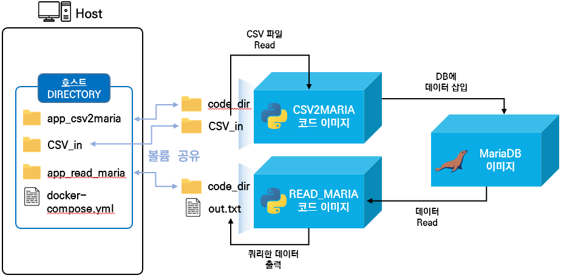
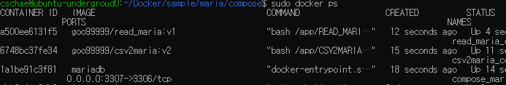
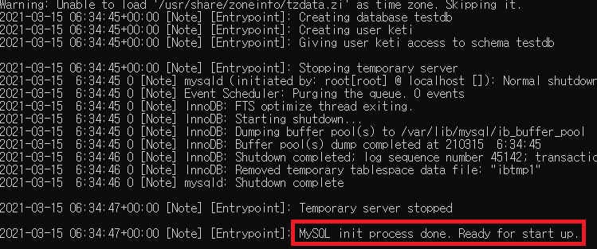
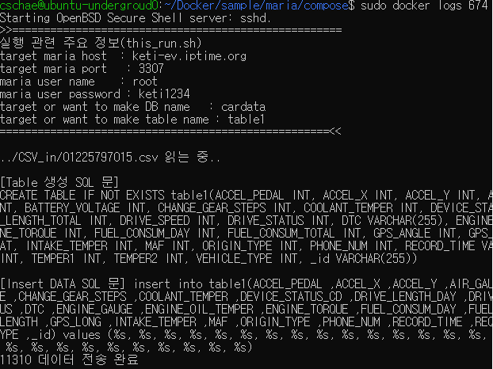
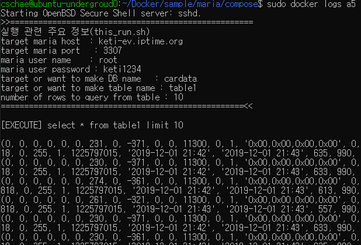

# CSV형태의 데이터를 MARIADB에 저장 및 쿼리 기능 구현 (리포)
#### 개요
- CSV형태의 데이터를 MARIA디비 컨테이너에 전송하여 저장하거나 저장된 데이터를 쿼리하여 출력해주는 Docker Container 구조의 S/W

## 전체구조

  - 
  
  - 컨테이너 설명 
    - CSV2MARIA : 지정한 디렉토리(CSV_in)에 존재하는 csv파일의 데이터를 MariaDB에 저장해준다.
    - READ_MARIA : MARIADB로부터 초기 입력인자로 설정한 테이블의 데이터를 불러와 화면및 out.txt에 출력해준다.
    - 
  - git 디렉토리 구조
  ```code
    maria
    ├── app_csv2maria (CSV파일 데이터를 maria디비에 저장해주는 코드와 이를 도커 이미지로 빌드해주는 dockerfile이 존재)
    ├── app_read_maria (maria디비의 데이터를 쿼리하여 출력해주는 코드와 이를 도커 이미지로 빌드해주는 dockerfile이 존재)
    ├── compse (docker-compose를 실행시킬수 있는 디렉토리)
    │   ├── CSV_in (mariaDB에 저장할 CSV파일이 존재하는 디렉토리, 실행시 csv2maria 컨테이너에 마운트됨)
    │   ├── app_csv2maria_volumes (csv2maria의 소스코드 디렉토리, 실행시 csv2maria 컨테이너에 마운트됨)
    │   ├── app_read_maria_volumes (read_maria의 소스코드 디렉토리, 실행시 read_maria 컨테이너에 마운트됨)
    └   └── docker-compose.yml (docker-composer로 실행하기전 각 컨테이너의 설정을 셋팅할 수 있는 yaml파일)
  ```

## 설치 및 동작 테스트 

  1. github repo clone 혹은 zip파일 다운로드
  
      - git clone
      
          ```console
          $ git clone https://github.com/KETI-IISRC/Docker
          ```
      
  2. file_to_opentsdb compose 디렉토리로 이동
  
            $ cd Docker/sample/maria/compose


  3. docker-compose.yml파일 수정(수정할 내용은 하단에 기재)
            
            $ vi docker-compose.yml

     - 수정부분 설명
       - 각 서비스의 environment, volumes, ports 필요에따라 수정
        
        ```code
        version: '3'

        services: 
            mariadb:
                image: mariadb    # mariaDB 서비스
                ports: 
                    - 3307:3306   # service port를 정의 (local:container)
                restart: always   # container를 실행할 때 항상 이미 수행중이라면 재시작
                volumes:          # 예기치 못한 문제로 컨테이너가 종료되어도 DB의 데이터와 설정을 보전 및 백업하기 위한 볼륨 공유 (local : container) 
                    - ./mariadb_volumes/data:/var/lib/mysql
                    - ./mariadb_volumes/conf.d:/etc/mysql/conf.d
                environment:      # mariaDB 구축시 환경 변수
                    MYSQL_USER: keti
                    MYSQL_PASSWORD: keti1234
                    MYSQL_ROOT_PASSWORD: keti1234
                    MYSQL_DATABASE : testdb


            app_csv_to_maria:
            image: goo99999/csv2maria:v2
            #container에 ssh 접속을 위해 로컬포트:컨테이너내부포트 포트포워딩
            #ports:
            # - "5004:22"
            volumes:
                - "./app_csv2maria_volumes:/app/CSV2MARIA"
                - "./CSV_in:/app/CSV_in"
            environment:
                - MARIA_IP=keti-ev.iptime.org # 접속할 MARIA디비의 ip
                - MARIA_PORT=3307 # 접속할 MARIA디비의 port
                - MARIA_USER=root # 접속할 MARIA디비의 루트 사용자명
                - MARIA_PASSWORD=keti1234 # 접속할 MARIA디비의 루트 사용자 비밀번호
                - MARIA_DB_NAME=cardata # 접속하거나 새로 생성할 MARIA디비의 DB이름
                - MARIA_TABLE_NAME=table1 # 접속하거나 새로 생성할 MARIA디비의 TABLE이름
            container_name: csv2maria_container
            depends_on: # 지정한 컨테이너가 구동 완료되면 본 컨테이너 시동
                - mariadb
            

            app_read_maria:
            image: goo99999/read_maria:v1
            #container에 ssh 접속을 위해 로컬포트:컨테이너내부포트 포트포워딩
            #ports:
            # - "5004:22"
            volumes:
                - "./app_read_maria_volumes:/app/READ_MARIA"
            environment:
                - MARIA_IP=keti-ev.iptime.org # 접속할 MARIA디비의 ip
                - MARIA_PORT=3307 # 접속할 MARIA디비의 port
                - MARIA_USER=root # 접속할 MARIA디비의 루트 사용자명
                - MARIA_PASSWORD=keti1234 # 접속할 MARIA디비의 루트 사용자 비밀번호
                - MARIA_DB_NAME=cardata # 접속할 MARIA디비의 DB이름
                - MARIA_TABLE_NAME=table1 # 접속할 MARIA디비의 TABLE이름
                - QUERY_ROWS=10 # table로부터 쿼리할 총 row 수 
            container_name: read_maria_container
            depends_on: # 지정한 컨테이너가 구동 완료되면 본 컨테이너 시동
                - app_csv_to_maria
        ```

  4. docker-compose로 container 실행

        ```console
        $ sudo docker-compose up -d # 모든 컨테이너 한번에 실행
        
        # 따로 실행
        $ sudo docker-compose up -d mariadb # mariadb 컨테이너 실행
        $ sudo docker-compose up -d csv2maria_container # csv or data put 컨테이너 실행
        $ sudo docker-compose up -d read_maria_container # mariaDB 데이터 csv로 저장해주는 컨테이너 실행
                  
        ```
      
  - docker-compose 실행 결과
    - ```console
      # sudo docker ps
      ```
      
    - mariadb 컨테이너 실행, 결과
      - ```console
        $ sudo docker logs -f mariadb
        ```
      
    
    - CSV2maria 컨테이너 실행, 결과
      - ```console
        $ sudo docker logs -f csv2maria_container
        ```
      
    
    - read_maria 컨테이너 실행, 결과
      - ```console
        $ sudo docker logs -f read_maria_container
        ```
      

## 실행중인 컨테이너 접근
  - 실행중인 컨테이너의 shell 접근
    ```console
    $ sudo docker exec -it [컨테이너 명 or 컨테이너 id] /bin/bash
    ```
  - 실행중인 컨테이너에 명령어 전달
    ```console
    $ sudo docker exec -it [컨테이너 명 or 컨테이너 id] [전달할 명령어]
    ```
