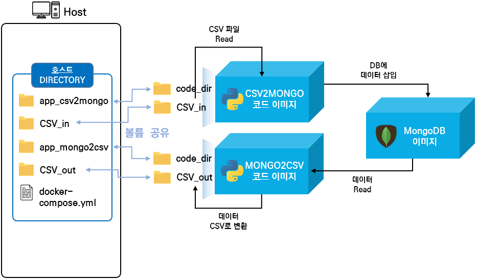
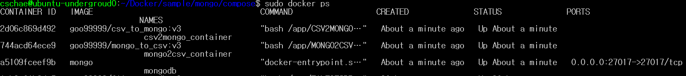
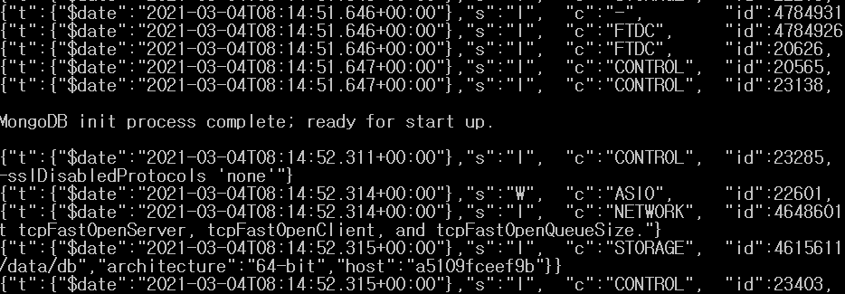
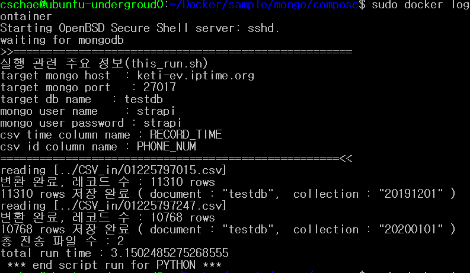
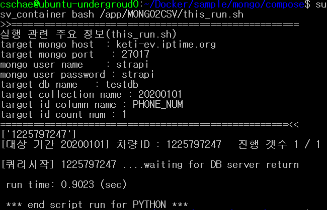

# CSV형태의 데이터를 몽고디비에 read / write 기능 구현 (리포)
#### 개요
- CSV형태의 데이터를 몽고디비 컨테이너에 전송하여 저장하거나 저장된 데이터를 읽어서 CSV파일로 저장하는 Docker Container 구조의 S/W

## 전체구조

  - 
  
  - 컨테이너 설명 
    - CSV2MONGP : 지정한 디렉토리(CSV_in)에 존재하는 csv파일의 데이터를 MongoDB에 저장해준다.
    - MONGO2CSV : MongoDB로부터 초기 입력인자로 설정된 데이터를 불러와서 CSV파일로 변환 후 CSV_out디렉토리에 저장해준다.
    - 
  - git 디렉토리 구조
  ```code
    mongo
    ├── app_csv2mongo (CSV파일 데이터를 몽고디비에 저장해주는 코드와 이를 도커 이미지로 빌드해주는 dockerfile이 존재)
    ├── app_mongo2csv (몽고디비의 데이터를 CSV파일로 저장해주는 코드와 이를 도커 이미지로 빌드해주는 dockerfile이 존재)
    ├── compse (docker-compose를 실행시킬수 있는 디렉토리)
    │   ├── CSV_in (몽고DB에 저장할 CSV파일이 존재하는 디렉토리, 실행시 csv2mongo 컨테이너에 마운트됨)
    │   ├── CSV_out (몽고DB에서 읽은 데이터가 CSV파일로 변환되어 저장될 디렉토리, 실행시 mongo2csv 컨테이너에 마운트됨)
    │   ├── app_csv2mongo_volume (csv2mongo의 소스코드 디렉토리, 실행시 csv2mongo 컨테이너에 마운트됨)
    │   ├── app_mongo2csv_volume (mongo2csv의 소스코드 디렉토리, 실행시 mongo2csv 컨테이너에 마운트됨)
    └   └── docker-compose.yml (docker-composer로 실행하기전 각 컨테이너의 설정을 셋팅할 수 있는 yaml파일)
  ```

## 사전준비

- Docker Desktop 및 docker-compose 실행 가능해야 함

  1.  리눅스/우분투 docker/docker-compose 설치
  
      https://hcnam.tistory.com/25
      
  2. 윈도우
  
     - docker/docker-compose 설치
  
       https://steemit.com/kr/@mystarlight/docker
     
     - 도커 툴박스 설치

       https://github.com/docker/toolbox/releases
  
- csv, 엑셀 파일의 time format
  - 초 단위의 경우 time format 

    - YYYY-MM-DD HH:MM:SS    ex) 2020-01-20 10:20:20


## 설치 및 동작 테스트 

  1. github repo clone 혹은 zip파일 다운로드
  
      - git clone
      
          ```console
          $ git clone https://github.com/KETI-IISRC/Docker
          ```
      
  2. file_to_opentsdb compose 디렉토리로 이동
  
            $ cd Docker/sample/mongo/compose


  3. docker-compose.yml파일 수정(수정할 내용은 하단에 기재)
            
            $ vi docker-compose.yml

     - 수정부분 설명
       - 각 서비스의 environment, volumes, ports 필요에따라 수정
        
        ```code
        version: '3'

        services: 
            mongodb:          # mongoDB 서비스
            image: mongo    # 해당 service에서 사용할 image입니다.
            restart: always # container를 실행할 때 항상 이미 수행중이라면 재시작을 수행합니다.
            environment:    # 환경변수를 정의합니다.
                MONGO_INITDB_ROOT_USERNAME: strapi # 설정할 mongoDB의 root사용자 아이디
                MONGO_INITDB_ROOT_PASSWORD: strapi # 설정할 mongoDB의 root사용자 패스워드
            volumes:        # container -> local로 mount할 수 있습니다.
                - "./mongodata/db:/data/db" # local:container
            container_name: "mongodb" # container의 name을 정의합니다.
            ports:                # service port를 정의합니다.
                - '27017:27017'     # local:container

            app_csv_to_mongo:
            image: goo99999/csv_to_mongo:v3
            #container에 ssh 접속을 위해 로컬포트:컨테이너내부포트 포트포워딩
            #ports:
            # - "5004:22"
            volumes:
                - "./app_csv2mongo_volume:/app/CSV2MONGO"
                - "./CSV_in:/app/CSV_in"
            environment:
                - MONGO_IP=keti-ev.iptime.org # 접속할 몽고디비의 ip
                - MONGO_PORT=27017 # 접속할 몽고디비의 port
                - MONGO_DB_NAME=testdb # 접속할 몽고디비의 DB이름
                - MONGO_USER=strapi # 접속할 몽고디비의 사용자명
                - MONGO_PASSWORD=strapi # 접속할 몽고디비의 사용자 비밀번호
                - CSV_TIME_COL=RECORD_TIME # 몽고디비에 저장할 CSV파일의 시간 데이터 컬럼명
                - CSV_ID_COL=PHONE_NUM # 몽고디비에 저장할 CSV파일의 차량번호 데이터 컬럼명
            container_name: csv2mongo_container
            links:
                - mongodb:db

            app_mongo_to_csv:
            image: goo99999/mongo_to_csv:v3
            #container에 ssh 접속을 위해 로컬포트:컨테이너내부포트 포트포워딩
            #ports:
            # - "5004:22"
            volumes:
                - "./app_mongo2csv_volume:/app/MONGO2CSV"
                - "./CSV_out:/app/CSV_out"
            environment:
                - MONGO_IP=keti-ev.iptime.org # 접속할 몽고디비의 port
                - MONGO_PORT=27017 # 접속할 몽고디비의 port
                - MONGO_USER=strapi # 접속할 몽고디비의 사용자명
                - MONGO_PASSWORD=strapi # 접속할 몽고디비의 비밀번호
                - MONGO_DB_NAME=testdb # 접속할 몽고디비의 DB이름
                - MONGO_COLL_NAME=20200101 # 접속할 몽고디비의 Collection이름
                - ID_COLUMN=PHONE_NUM # 몽고디비에서 쿼리할 차량 번호의 컬럼명
                - ID_QUERY_COUNT=1 # 몽고디비에서 쿼리할 차량의 MAX수
            container_name: mongo2csv_container
            links:
                - mongodb:db
        ```

  4. docker-compose로 container 실행

        ```console
        $ sudo docker-compose up -d # 모든 컨테이너 한번에 실행
        
        # 따로 실행
        $ sudo docker-compose up -d mongodb # mongodb 컨테이너 실행
        $ sudo docker-compose up -d csv2mongo_container # csv or data put 컨테이너 실행
        $ sudo docker-compose up -d mongo2csv_container # mongoDB 데이터 csv로 저장해주는 컨테이너 실행
                  
        ```
      
  - docker-compose 실행 결과
    - ```console
      # sudo docker ps
      ```
      
    - mongodb 컨테이너 실행, 결과
      - ```console
        $ sudo docker logs -f mongo
        ```
      
    
    - CSV2MONGO 컨테이너 실행, 결과
      - ```console
        $ sudo docker logs -f csv2mongo_container
        ```
      
    
    - MONGO2CSV 컨테이너 실행, 결과
      - ```console
        $ sudo docker logs -f mongo2csv_container
        ```
      

## 실행중인 컨테이너 접근
  - 실행중인 컨테이너의 shell 접근
    ```console
    $ sudo docker exec -it [컨테이너 명 or 컨테이너 id] /bin/bash
    ```
  - 실행중인 컨테이너에 명령어 전달
    ```console
    $ sudo docker exec -it [컨테이너 명 or 컨테이너 id] [전달할 명령어]
    ```
