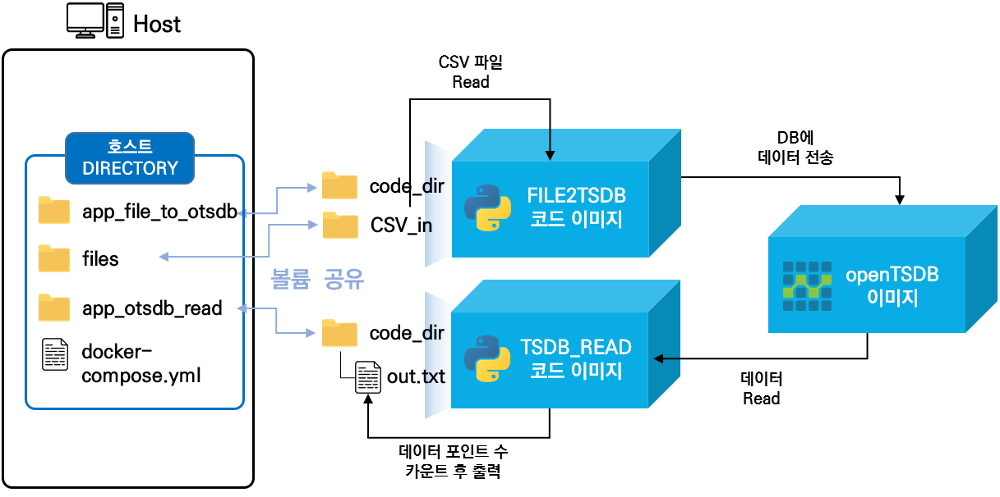
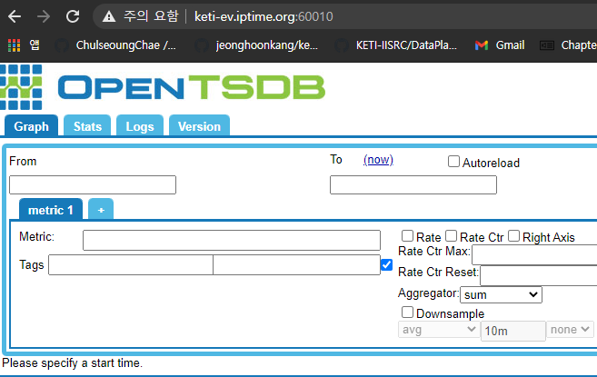
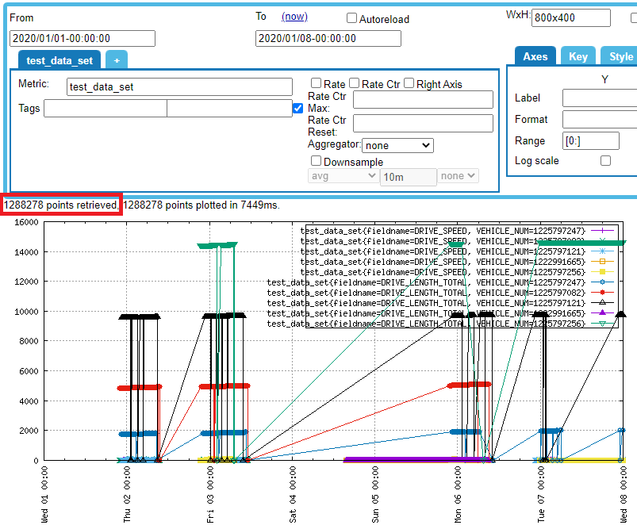
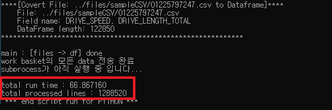
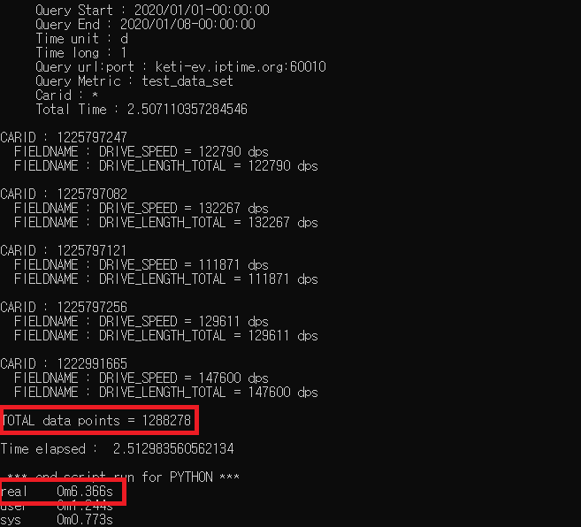

# 1 Million 이상의 data point OpenTSDB read & write TEST sample Code 

## 전체구조

  - 

  - 컨테이너 설명
    - FILE2TSDB : 지정된 디렉토리의 모든 CSV파일을 읽어서 데이터를 추출한 후 json포멧으로 변환 후 OpenTSDB에 전송해준다.
    - TSDB_READ : OpenTSDB로부터 데이터를 쿼리하여 태그별 데이터 포인트 수 모든 데이터 포인트 수를 out.txt에 출력해준다.

  - 디렉토리 구조
    ```code
      opentsdb_read_write_test
      ├── app_file_to_otsdb (CSV파일 데이터를 OpenTSDB에 저장해주는 코드와 이를 도커 이미지로 빌드해주는 dockerfile이 존재)
      ├── app_otsdb_read (OpenTSDB의 데이터를 태그별 그리고 총 데이터 포인트 수를 출력해주는 코드와 이를 도커 이미지로 빌드해주는 dockerfile이 존재)
      ├── compse (docker-compose를 실행시킬수 있는 디렉토리)
      │   ├── files (openDB에 저장할 CSV파일이 존재하는 디렉토리, 실행시 csv2otsdb 컨테이너에 마운트됨)
      │   ├── app_file2otsdb_volume (csv2otsdb의 소스코드 디렉토리, 실행시 csv2otsdb 컨테이너에 마운트됨)
      │   ├── app_otsdb_read_volume (otsdb_read의 소스코드 디렉토리, 실행시 otsdb_read 컨테이너에 마운트됨)
      └   └── docker-compose.yml (docker-composer로 실행하기전 각 컨테이너의 설정을 셋팅할 수 있는 yaml파일)
    ```

## 100만개 이상의 datapoint write & read 동작 테스트 과정

  1. github repo clone 후 docker 실행 디렉토리로 이동
  
      - git clone & compose 디렉토리로 이동
      
          ```
          $ git clone https://github.com/KETI-IISRC/Docker

          $ cd ./Docker/sample/opentsdb_read_write_test/compose
          ```

  2. 대량의 데이터가 저장된 CSV파일들 불러오기

      - 대량의 CSV파일은 시흥서버 /home/cschae/sampleCSV 내에 존재 (총 5개의 CSV파일)
      
          ```
          $ rsync -avhz --progress --partial -e 'ssh -p 7771' 서버userID@59.14.236.153:/home/cschae/sampleCSV ./files
          
          ```

  3. docker-compose.yml 파일 수정

      - 각 컨테이너의 environment, volumes, ports 필요에따라 수정
        
        ```code
        version: '3'

        services: 

            opentsdb: # opentsdb 서비스 이미지
              image: petergrace/opentsdb-docker:latest
              restart: always
              ports:
                  - "60010:4242"
              volumes:
                - "./opentsdb_volume:/data/hbase"
              container_name: opentsdb_container


            app_csv_to_opentsdb: # csv파일들의 데이터를 opentsdb에 저장해주는 파이썬 코드의 이미지
              image: goo99999/file_to_tsdb:v3
              #container에 ssh 접속을 위해 로컬포트:컨테이너내부포트 포트포워딩
              #ports:
              # - "5004:22"
              volumes:
                - "./app_file2otsdb_volume:/app/FILE2TSDB"
                - "./files:/app/files"
              environment:
                - TSDB_IP=keti-ev.iptime.org  # 저장할 opentsdb의 ip
                - TSDB_PORT=60010 # 저장할 opentsdb의 port
                - FIELDNAME=DRIVE_SPEED|DRIVE_LENGTH_TOTAL # openTSDB에 저장할 CSV파일 데이터의 컬럼명 ('|'문자로 여러 컬럼 저장가능)
                - IDFIELD=PHONE_NUM # openTSDB에 저장할 CSV파일의 데이터 중 carid 컬럼명
                - TIMEFIELD=RECORD_TIME # openTSDB에 저장할 CSV파일의 시간 데이터 컬럼명
                - METRIC=test_data_set # openTSDB에 저장할 metric(table) 명
                - PN=2 # csv데이터를 json format으로 변환시키는 프로세스의 수 (PC 사양에 따라 알맞게 지정) 
                - CN=2 # 변환된 json데이터를 opentsdb에 전송해주는 프로세스의 수 (PC 사양에 따라 알맞게 지정) 
              container_name: csv2otsdb_container
              # --link 옵션을 이용해 opentsdb container 와 link를 맺을 것을 설정한다. 
              # 이렇게 설정하면, csv_to_opentsdb container 는 opentsdb container 를 IP 가 아닌 container의 이름을 이용해 통신할 수 있다.
              # csv_to_opentsdb container의 /etc/hosts 파일에 opentsdb container의 IP 주소와 host명이 등록되어 있다.
              links:
                - opentsdb:db
                

            app_opentsdb_read: # opentsdb의 data를 쿼리하여 총 data points의 수를 count해주는 파이썬 코드의 이미지
              image: goo99999/otsdb_read:v3
              #container에 ssh 접속을 위해 로컬포트:컨테이너내부포트 포트포워딩
              #ports:
              # - "5004:22"
              volumes:
                - "./app_otsdb_read_volume:/app/READ_TSDB"
              environment:
                - TSDB_IP=keti-ev.iptime.org  # 저장할 opentsdb의 ip
                - TSDB_PORT=60010 # 쿼리할 opentsdb port
                - TSDB_METRIC=test_data_set # 쿼리할 opentsdb metric명
                - QUERY_TIME_START=2020/01/01-00:00:00 # 쿼리할 opentsdb 시작 시간
                - QUERY_TIME_END=2020/01/08-00:00:00 # 쿼리할 opentsdb 끝 시간
                - CAR_ID=none # 쿼리할 차량 번호 ('none' 입력시 전체 차량 쿼리, '|' 문자로 여러 차량 쿼리 가능)
                - QUERY_TIME_UNIT=d # 쿼리할 전체기간 중 나눠 쿼리할 단위 ('d' = days, 'h' = hours, 'm' = minutes)
                - QUERY_TIME_LONG=1 # 쿼리할 전체기간 중 나눠 쿼리할 단위의 크기 (timeunit='d', timelong='7' => 7days)
              container_name: otsdb_read_container
              # --link 옵션을 이용해 opentsdb container 와 link를 맺을 것을 설정한다. 
              # 이렇게 설정하면, opentsdb_read container 는 opentsdb container 를 IP 가 아닌 container의 이름을 이용해 통신할 수 있다.
              # opentsdb_read container의 /etc/hosts 파일에 opentsdb container의 IP 주소와 host명이 등록되어 있다.
              links:
                - opentsdb:db
        ```

  4. docker-compose 실행
      - opentsdb 컨테이너 실행
      
          ```
          $ sudo docker-compose up -d opentsdb
          
          ```
        - opentsdb 컨테이너 구동 확인
        
            ```
            $ sudo docker ps # 실행중인 컨테이너 확인
            
            ```
        - 구동 완료 후 opentsdb web 접속 (완전히 구동되기까지 30초~1분 소요)
          - 


      - csv_to_opentsdb 컨테이너 실행
      
          ```
          $ sudo docker-compose up -d app_csv_to_opentsdb
          
          ```
        - csv_to_opentsdb 컨테이너 구동 확인
        
            ```
            $ sudo docker ps # 실행중인 컨테이너 확인

            $ sudo docker logs [container ID] # 실행중인 컨테이너 로그확인
            
            ```
        - 실행 완료 후 web에서 데이터 확인 및 로그 출력 내용 확인
          - 
          - 
          - 총 전송한 datapoint 수 : 약 120만개 / 총 전송 시간 : 66.86초


      - opentsdb_read 컨테이너 실행
      
          ```
          $ sudo docker-compose up -d app_opentsdb_read
          
          ```
        - opentsdb_read 컨테이너 구동 확인
        
            ```
            $ sudo docker ps # 실행중인 컨테이너 확인

            $ sudo docker logs [container ID] # 실행중인 컨테이너 로그확인
            
            ```
        - 실행 완료 후 로그 출력 내용 또는 compose/app_otsdb_read_volume/out.txt 확인
          - 
          - 총 쿼리한 datapoint 수 : 약 120만개 / 총 쿼리 및 카운트 시간 : 6.3초
