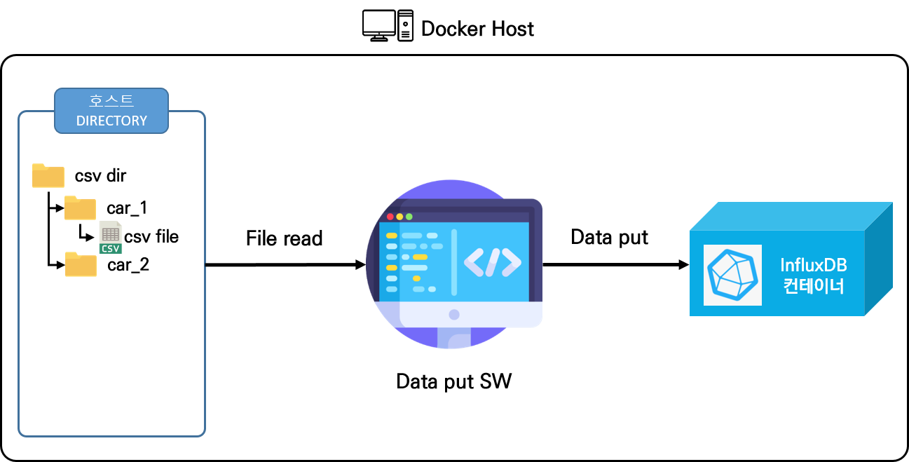

# 컨테이너 활용 S/W 샘플

- 다양한 컨테이너 응용 방법에 대한 예제
- 접속 위치
  - http://59.14.236.153:9000/
    (ID : keti / PW : keti1234!)

----

## 컨테이너 모니터링 및 관리
### Portainer (Docker Container Management Web Service)

  - Docker Web UI 관리툴

  - portainer 는 Web 기반 Dash Board 로 아래와 같은 기능을 제공
    - Docker CLI 기능 지원 : Start/Stop/Delete 등
    - Docker Container 별 리소스 모니터링 / 로그 분석 등 기능
    - Docker Container 별 실행 Shell 지원

  - 오픈소스로 배포되어 무료로 사용 가능, shell에서 Docker 명령을 일일이 수행할 필요가 없이 Web UI 로 손쉽게 관리 가능

### 시흥서버에 portainer 구축

  - portainer docker 실행 명령어
    
        $ docker run -d -p [외부포트]:9000 -v /var/run/docker.sock:/var/run/docker.sock -v portainer_data:/data --restart=always portainer/portainer

  - http://59.14.236.153:9000/
    (ID : keti / PW : keti1234!)
    

----
## DB docker container

### OpenTSDB Container
#### OpenTSDB: HBase를 기반으로 동작하는 분산 및 확장이 가능한 시계열 데이터베이스


### 1. file_to_opentsdb : reading CSV/Excel file, making JSON from CSV, sending JSON to openTSDB, and store data in openTSDB

- [SW Link](https://github.com/KETI-IISRC/Docker/tree/main/sample/file_to_opentsdb)

- **컨테이너 설명**
    - **FILE2TSDB : 지정된 디렉토리의 모든 CSV파일을 읽어서 데이터 추출 및 JSON 형식으로 변환 후, OpenTSDB에 전송하는 컨테이너**
        ```code
      app_file_to_otsdb
      ├── app_file_to_otsdb: CSV 데이터를 OpenTSDB에 저장해주는 코드, docker image 생성 파일(Dockerfile) 내재
      │   ├── FILE2TSDB: convert CSV to JSON format, send JSON format to openTSDB and store data in openTSDB
      │   ├── data file: 01225797247.csv
      │   ├── docker image-generated file: Dockerfile, requirements.txt
      ├── compse: docker-compose 실행 디렉토리
      │   ├── data file: 01225797247.csv
      │   ├── app_file2otsdb_volume
      │   ├── opentsdb_volume 
      └   └── docker-compose.yml: docker-composer로 실행하기 전, 각 컨테이너의 설정을 셋팅할 수 있는 yml파일  
      ```

    

    - 실행 영상
      [](https://asciinema.org/a/398204)

### **2. opentsdb_read_write_test** : Test reading 1,000,0000 datapoints from CSV file and storing data in openTSDB & reading and counting 1,000,0000 datapoints from openTSDB

- [SW Link](https://github.com/KETI-IISRC/Docker/tree/main/sample/opentsdb_read_write_test)

- **컨테이너 설명**
    - **FILE2TSDB : 지정된 디렉토리의 모든 CSV파일을 읽어서 데이터 추출 및 JSON 형식으로 변환 후, OpenTSDB에 전송하는 컨테이너**
    - **TSDB_READ : OpenTSDB로부터 데이터 쿼리하여 태그별 모든 데이터 포인트 수를 out.txt에 출력하는 컨테이너**
        ```code
      opentsdb_read_write_test
      ├── app_file_to_otsdb: CSV 데이터를 OpenTSDB에 저장해주는 코드, docker image 생성 파일(Dockerfile) 내재
      ├── app_otsdb_read: OpenTSDB의 데이터 태그별 출력 및 총 데이터 포인트 수 출력 코드, docker image 생성 파일(Dockerfile) 내재
      ├── compse: docker-compose 실행 디렉토리
      │   ├── files: CSV file, 실행시 csv2otsdb 컨테이너에 마운트됨
      │   ├── app_file2otsdb_volume: csv2otsdb source code, 실행시 csv2otsdb 컨테이너에 마운트됨
      │   ├── app_otsdb_read_volume: otsdb_read source code, 실행시 otsdb_read 컨테이너에 마운트됨
      └   └── docker-compose.yml: docker-composer로 실행하기 전, 각 컨테이너의 설정을 셋팅할 수 있는 yml파일 
      ```
      
## InfluxDB Container
#### InfluxDB: 높은 쓰기 및 쿼리로드를 처리하도록 설계된 시계열 데이터베이스

- [SW Link](https://github.com/KETI-IISRC/Docker/tree/main/sample/influx)

- 

- **SW 설명**
    - **docker-compose.yml : InfluxDB 컨테이너를 실행하는 docker-compose파일**
    - **influx_put_data.py : files 디렉토리에 존재하는 csv파일 데이터를 InfluxDB에 저장해주는 코드**
   
  - 실행 영상
    [](https://asciinema.org/a/9BZtDtsycBZ3aVtPdJ0XB8Vqg)


## MongoDB Container
#### MongoDB: NoSQL 중 가장 많이 쓰이는 비관계형 데이터베이스

- [SW Link](https://github.com/KETI-IISRC/Docker/tree/main/sample/mongo)

- 

### mongo : reading csv file, sending csv data in mongoDB & reading data from mongoDB and convert data to CSV file

- **컨테이너 설명**
    - **CSV2MONGP :  CSV_in 디렉토리에 존재하는 csv파일 데이터를 MongoDB에 저장해주는 컨테이너**
    - **MONGO2CSV : MARIADB로부터 초기 입력인자로 설정한 테이블의 데이터를 불러와 화면 및 CSV_out에 출력해주는 컨테이너.**
  ```code
    mongo
    ├── app_csv2mongo: CSV 데이터를 mongoDB에 저장해주는 코드, docker image 생성 파일(Dockerfile) 내재
    ├── app_mongo2csv: mongoDB의 데이터 쿼리 출력 코드, docker image 생성 파일(Dockerfile) 내재
    ├── compse: docker-compose 실행 디렉토리
    │   ├── CSV_in: CSV file, 실행시 csv2mongo 컨테이너에 마운트됨
    │   ├── app_csv2mongo_volumes: csv2mongo source code, 실행시 csv2mongo 컨테이너에 마운트됨
    │   ├── app_mongo2csv_volumes: mongo2csv source code, 실행시 mongo2csv 컨테이너에 마운트됨
    └   └── docker-compose.yml: docker-composer로 실행하기 전, 각 컨테이너의 설정을 셋팅할 수 있는 yml파일 
    ```

    - 실행 영상
      [](https://asciinema.org/a/398202)

## MariaDB Container
#### MariaDB: 오픈소스의 관계형 데이터베이스

- [SW Link](https://github.com/KETI-IISRC/Docker/tree/main/sample/maria)

- 

### maria: CSV data storage and query function implementation in MARIADB
- **컨테이너 설명**
    - **CSV2MARIA : CSV_in 디렉토리에 존재하는 CSV파일 데이터를 MariaDB에 저장해주는 컨테이너**
    - **READ_MARIA : MARIADB로부터 초기 입력인자로 설정한 테이블의 데이터를 불러와 화면 및 out.txt에 출력해주는 컨테이너**
  ```code
    maria
    ├── app_csv2maria: CSV 데이터를 mariaDB에 저장해주는 코드, docker image 생성 파일(Dockerfile) 내재
    ├── app_read_maria: mariaDB의 데이터 쿼리 출력 코드, docker image 생성 파일(Dockerfile) 내재
    ├── compse: docker-compose 실행 디렉토리
    │   ├── CSV_in: CSV file, 실행시 csv2maria 컨테이너에 마운트됨
    │   ├── app_csv2maria_volumes: csv2maria source code, 실행시 csv2maria 컨테이너에 마운트됨
    │   ├── app_read_maria_volumes: read_maria source code, 실행시 read_maria 컨테이너에 마운트됨
    └   └── docker-compose.yml: docker-composer로 실행하기 전, 각 컨테이너의 설정을 셋팅할 수 있는 yml파일 
    ```

## RedisDB Container
#### RedisDB: 모든 데이터를 메모리에 저장하고 조회하기에 빠른 Read, Write 속도를 보장하는 비관계형 데이터베이스

- [SW Link](https://github.com/KETI-IISRC/Docker/tree/main/sample/redis)

- 

### redis: Test reading 1,000,0000 datapoints from csv file and storing data in RedisDB & reading and counting 1,000,0000 datapoints from RedisDB
- **컨테이너 설명**
    - **docker-compose.yml : RedisDB 컨테이너를 실행하는 docker-compose파일**
    - **redis_put_data.py : files 디렉토리에 존재하는 csv파일 데이터를 RedisDB에 저장해주는 코드**

    - 실행 영상
      [](https://asciinema.org/a/3OD36H2iGRMQIA2le4xoBEOdf)
