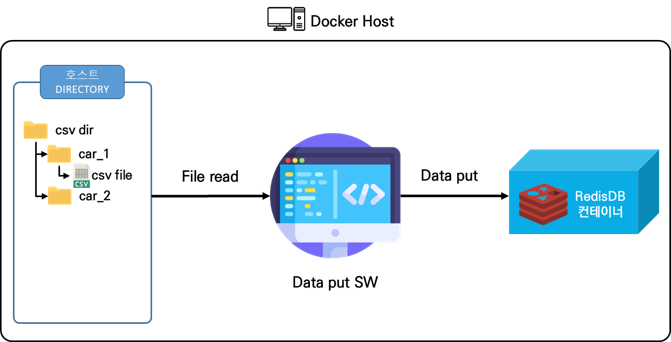
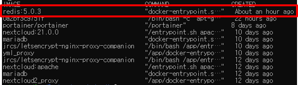
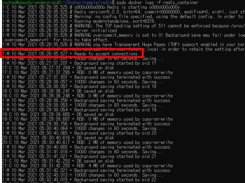
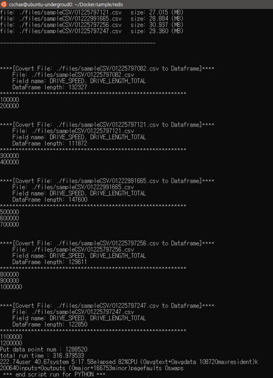

# Redis data read & write test sample Code 


## 전체구조

  - 

  - Redis 설명

    - RedisDB
      
      - REDIS(REmote Dictionary Server)는 메모리 기반의 “키-값” 구조 데이터 관리 시스템이며, 모든 데이터를 메모리에 저장하고 조회하기에 빠른 Read, Write 속도를 보장하는 비 관계형 데이터베이스

    - RedisDB 특징 및 장점
      - 영속성을 지원하는 인메모리 데이터 저장소
      - 읽기 성능 증대를 위한 서버 측 복제를 지원
      - 리스트, 배열과 같은 데이터를 처리하는데 유용


## 100만개 이상의 datapoint write & read 동작 테스트 과정

  1. github repo clone 후 redis docker 실행 디렉토리로 이동
  
      - git clone & compose 디렉토리로 이동
      
          ```
          $ git clone https://github.com/KETI-IISRC/Docker

          $ cd ./Docker/sample/redis
          ```

  2. 대량의 데이터가 저장된 CSV파일들 불러오기

      - 대량의 CSV파일은 시흥서버 /home/cschae/sampleCSV 내에 존재 (총 5개의 CSV파일)
      
          ```
          $ rsync -avhz --progress --partial -e 'ssh -p 7771' 서버userID@59.14.236.153:/home/cschae/sampleCSV ./files
          
          ```

  3. this_run.sh 파일 수정

      - 각 redis 컨테이너의 ip, port 설정에따라 수정
        
        ```
        #!/bin/bash

          # read 할 csv 정보 및 redis 정보

          # [1] target field name, 2개 이상의 필드 입력할때 공란없이 붙여서 | 로 표시함 
          field="DRIVE_SPEED|DRIVE_LENGTH_TOTAL"
          # [2] csv time field name
          ts="RECORD_TIME"
          # [3] csv id field name
          carid="PHONE_NUM"
          # [4] redis ip
          ip="192.168.99.100"
          # [5] redis port
          port=6379

          echo ">>===================================================="
          echo "실행 관련 주요 정보(this_run.sh)"
          echo "target field name  : "$field
          echo "csv time field name   : "$ts
          echo "csv id field name   : "$carid
          echo "redis ip : "$ip
          echo "redis port    : " $port
          echo "====================================================<<"

          # 인자값 5개
          #                   [1]   [2]  [3]    [4]  [5]    
          time python3 redis_put_data.py $field $ts $carid $ip $port

          echo " *** end script run for PYTHON *** "
        ```
        

  4. docker-compose 실행
      - redis 컨테이너 실행
      
          ```
          $ sudo docker-compose up -d
          
          ```
        - redis 컨테이너 구동 확인
        
            ```
            $ sudo docker ps # 실행중인 컨테이너 확인
            
            ```
          
        
        - redis log 확인

            ```
            $ sudo docker logs redis_container
            ```
          

      - redisdb에 데이터 입력code 실행
      
          ```
          $ ./this_run.sh
          
          ```

        