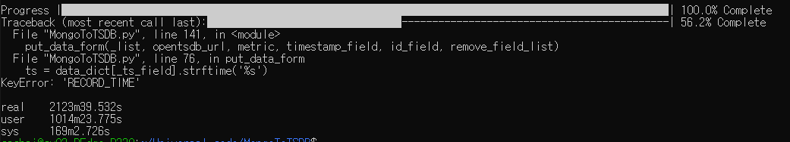

## - MongoToTSDB
- 코드 동작
  - MongoDB에서 데이터를 쿼리요청해 리턴되는 결과를 openTSDB로 put

- 진행중 작업
  - 54242서버에서 코드 실행중 총 130,000,000라인중 48,000,000라인에서 key에러발생하여 확인중
  - 

  - 우선 48,000,000라인(34개 field)을 Mongo에서 쿼리하고 TSDB에 put하는데 걸리는 시간이 약 53시간(3200분)정도 소요됨을 확인