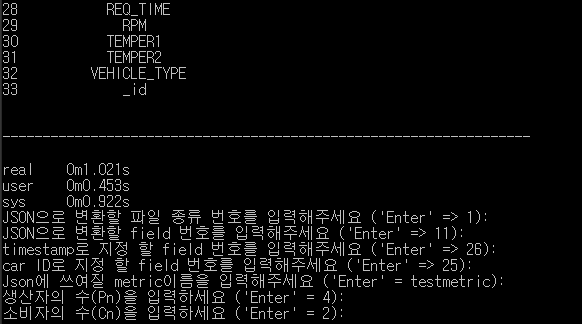
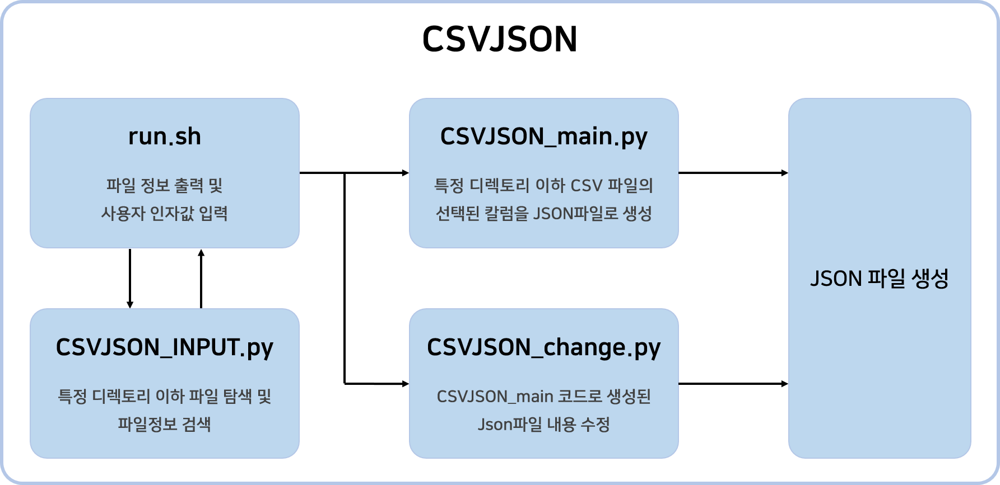
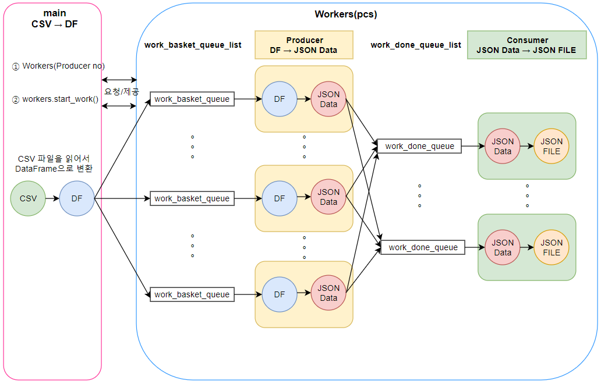
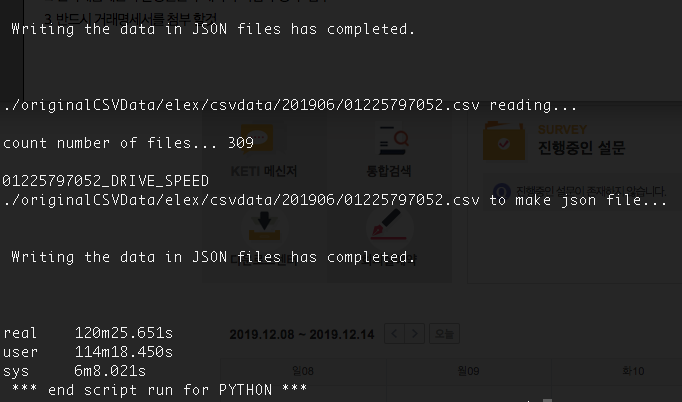
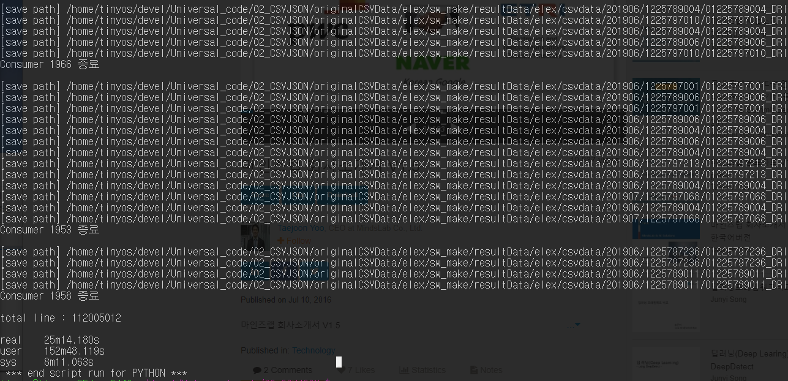
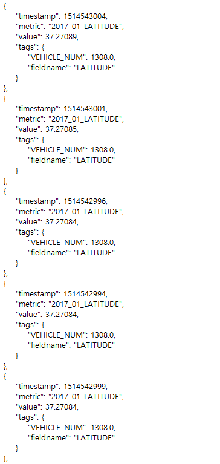
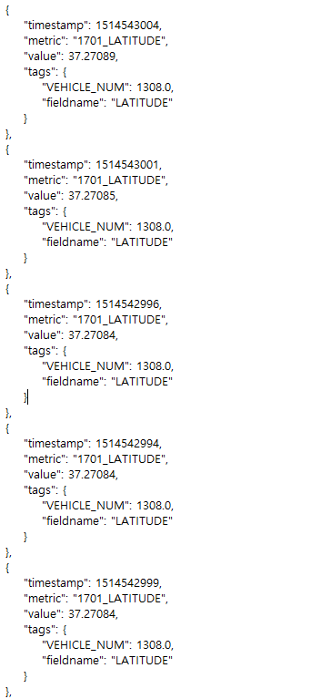

## 파일설명 및 실행방법(CSVJSON)
- 실행방법 : ./run.sh
   - 실행관련 세부 내용은 run.sh 스크립트 참조
   - 실행시 csv를 json으로 바꾸는 작업과 Json 파일을 수정하는 작업중 사용자가 선택한 것을 실행해준다.
   - 실행시 각 파일 종류에 따른 field(column) 목록을 보여주고 사용자로부터 처리할 필드명을 입력거나 Json파일에서 수정할 문자열과 수정된 후의 문자열을 입력받는다
   - 실행 관련 기본 내용
      - ex) python CSVJSON_main.py filetype bundle filekind field ts carid metric outdir pn cn
      - argument : 
        - file type (csv/xlsx)
        - bundle (Json 파일로 묶는 갯수)
        - filekind (filed목록별로 분류된 파일 종류 번호 (1,2,3,...) )
        - field (처리할 column)
        - ts (저장될 timestamp column)
        - carid (저장될 car number column)
        - metric (json파일 변환시 사용할 metric명)
        - outdir (json파일이 저장될 경로)
        - pn (생산자의 수)
        - cn (소비자의 수)
      - ex) python CSVJSON_change.py rename_field strold strnew
      - argument : 
        - rename_field (key or value)
        - strold (timestamp or metric or value or tags)
        - strnew (strold key나 value를 변활할 새로운 문자열)

- 실행화면
   - 
 
     
## 코드 실행 순서 및 설명

### 전체 코드 동작
  - 모식도
    
  
  
### ①run.sh : 
- MainCode(메인 동작 코드 파일 이름)
- file_type(입력 파일 종류. csv/excel) 
- bundle(한번 기록할 때 몇개의 json을 묶어서 기록할지)
- filekind (json 파일에 기록될 파일 종류 번호 (1,2,3,...) )
- field(json 파일에 기록될 칼럼)
- metric(json 파일 변환시 사용할 metric명)
- rename_field(json 파일 변환시 수정할 key또는 value)
- strold(json 파일 변환시 수정할 timestamp or metric or value or tags)
- strnew(json 파일 변환시 수정될 text)
    
### ② CSVJSON_INPUT.py : 
- 모든 디렉토리의 CSV/excel 파일을 찾고 데이터프레임으로 만들어 칼럼에 따라 분류된 파일 종류와 칼럼들을 출력하여 사용자에게 보여줌

- 주요함수
   - recursive_search_dir(_nowDir, _filelist) 함수
     - 현재 디렉토리와 서브디렉토리들을 재귀적으로 탐색하여 새로 추가된 모든 파일을 리스트에 담음
   - _get_fieldlist(_filelist, _type) 함수
     - recursive_search_dir() 로부터 받은 파일 리스트의 칼럼을 추출하고 file_type.py의 내용을 갱신함
   - renewFileTypeDir() 함수
     - 가장 먼저 실행되는 함수로 file_type.py의 내용을 바탕으로 삭제 또는 수정된 파일이 있으면 갱신해준다.
   - print_fields():
     - file_type.py의  데이터를 불러와 디렉토리 정보와 필드 목록을 출력해준다.
     
### ③ CSVJSON_main.py : 
- ../originalCSVData/ 디렉토리(또는 사용자 지정 디렉토리)와 하위 디렉토리안의 모든 CSV 혹은 excel파일 중 선택한 입력파일 종류만 읽어 선택된 칼럼의 데이터만 처리
- OpenTSDB에 입력할 수 있는 Json형식으로 변환

- 주요함수
   - writeJson(_buffer, _metric_name) 함수
     - JSON txt 파일 생성 후 JSON 포맷의 파일을 씀
   - writeJsonfiles(_buffer, _metric_name, _num) 함수
     - 사용자가 입력한 argument 갯수 별로 JSON txt 파일 생성
   - ToJsonFormat(_list, _metric_name, _bundle, _field, _filename) 함수
     - 각 csv파일에서 얻은 df바탕으로 field, carid, timestamp를 얻어서 JsonFormat으로 만들어준다.
- 멀티 프로세싱 적용
  - main (CSV file -> DF)
    - CSV 파일들을 하나씩 읽어서 DataFrame으로 변환
    - DataFrame을 생산자 프로세스 수(Pn)만큼 분할 하여 각 생산자 프로세스 큐(work_basket_queue)에 전달
  - Producer Process (DF -> Json Buffer)
    - 처리 시간이 가장 긴 단계로 사용자로부터 프로세스 갯수를 입력받음
    - 큐에서 분할된 dataFrame을 받은 후 Json형태로 변환후 buffer에 저장
    - buffer를 소비자 프로세스 큐(work_done_queue)에 전달
  - Consumer Process (Json Buffer -> JsonFile)
    - 각 큐에서 받은 buffer를 모두 합친 후 Json file로 저장
    - 멀티 프로세스 적용(프로세스 수(Cn)를 사용자로 부터 입력받을 수 있음)
    - Producer Process들의 처리 결과가 각 work_done_queue(1,2,...,n)에 순차적으로 전달됨
  - CSVJSON.py FrameWork
    - 
    
  - 실행결과
    - 약 300개의 CSV파일 처리 (24GGbyte, 100.000.000 lines)
    - 기존방식
      - 
    - 병렬처리 적용(pn=6, cn=4)
      - 
   
    
### ④ CSVJSON_change.py :
- CSVJSON_main에서 만든 json파일의 내용(metric, timestamp, tags등)을 수정해준다.

- 주요함수
   - changeJsonStr(_rename_field, _oldstr, _newstr) 함수
     - 기존의 JSON 데이터를 수정해준다.
     
### ⑤ type_file.py :
- CSVJSON_INPUT.py 실행시 초기에 만들어 지는 python 파일. 필드 목록 출력 runtime을 간소화 하기위해 생성되며 각 파일의 위치와 필드목록을 가지고있는 변수 file_type 딕셔너리와 각 디렉토리의 파일명과 lines수 정보를 가지고 있는 딕셔너리를 가지고 있다.
  

## 진행상황
- 완료 내용
  - 현재디렉토리와 서브디렉토리를 탐색하여 발견한 csv파일들을 찾은 후 선택한 필드를 json파일로 만들고 만든 json 파일에서 사용자가 입력한 문자열을 원하는 문자열로 바꿔줌
 - 결과
   - 만들어진 Json 파일들은 /originalCSVData/swmake/resultData 디렉토리에 저장
    - 
   - ResultJson에서 수정된 Json 파일들은 /originalCSVData/swmake/changedData 디렉토리에 저장 
   - 기존에는 CSVJSON_main.py에 있는 기능이지만 분리하여 CSVJSON_change.py에 기능을 옮김
   - 
