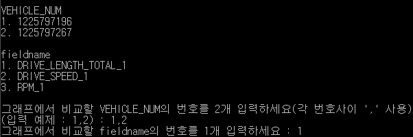
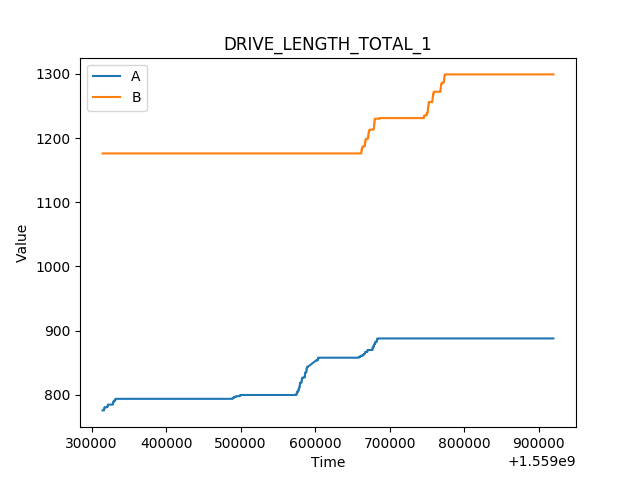

### JsonGraph
- 로컬상의 디렉토리에 있는 Json 파일을 읽어 시간에 따른 2대 차량의 field의 value를 그래프로 출력하여 비교해주는 코드 
----------
#### 코드 실행 내용
- 코드 실행시 json파일을 읽어 출력 가능한 carID와 fieldname을 보여주고 사용자가 선택한 2대의 차량과 field를 matplotlib을 이용하여 그래프로 출력해준다.
- json파일을 읽은 내용은 다음 실행시 런타임을 줄이기 위해 __dataInfo.py에 datalist로 저장해뒀다. (사용자 입력에 따라 새로 만들거나 기존것 사용 가능)
- 실행방법 : ./run.sh

----------
#### 실행화면
- 
- 
----------
#### 개선점
- 새로운 파일이 추가될때 갱신하면 기존것도 같이 갱신이 되는데 추가된 파일만 갱신되게 기능 추가 
