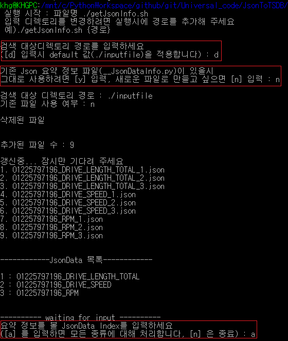
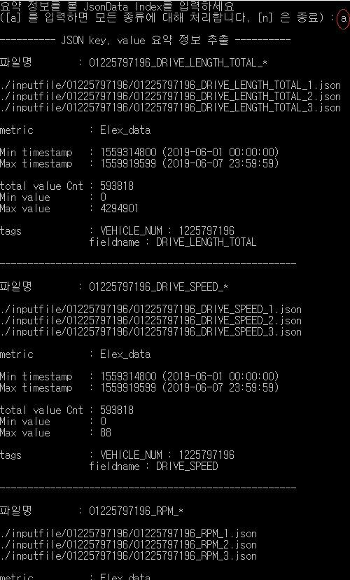
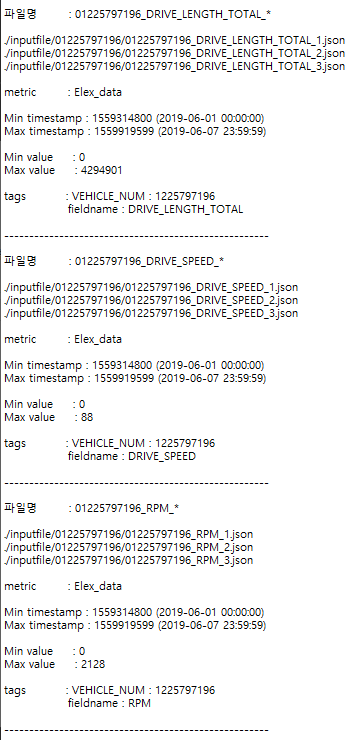

1. 코드 설명
- MainCode : InformJson.py
  - 쉘(getJsonInfo.sh)에서 지정한 디렉토리의 json파일들을 읽어서 각 파일들의 정보를 요약하여 python 파일(InformJson.py)로 저장해주고 갱신해줌
  - 한번 갱신해 놓으면 다음 실행시 갱신할 필요 없음

- showJson.py
  - 쉘 스크립트 실행시 사용자가 선택한 Json 요약 정보를 출력해줌

- InformJson.py
  - InformJson.py에서 요약된 Json의 정보 data가 있는 파이썬 파일
  - 각 파일의 요약 정보 내용
    - 파일명, 파일 경로, metric, Min Timestamp, Max timestamp, total Value count, Min value, Max value, tags

2. 코드 실행 방법 : <code>./getJsonInfo.sh</code>

3. 실행 화면
- 
- 
- logs.txt
- 
