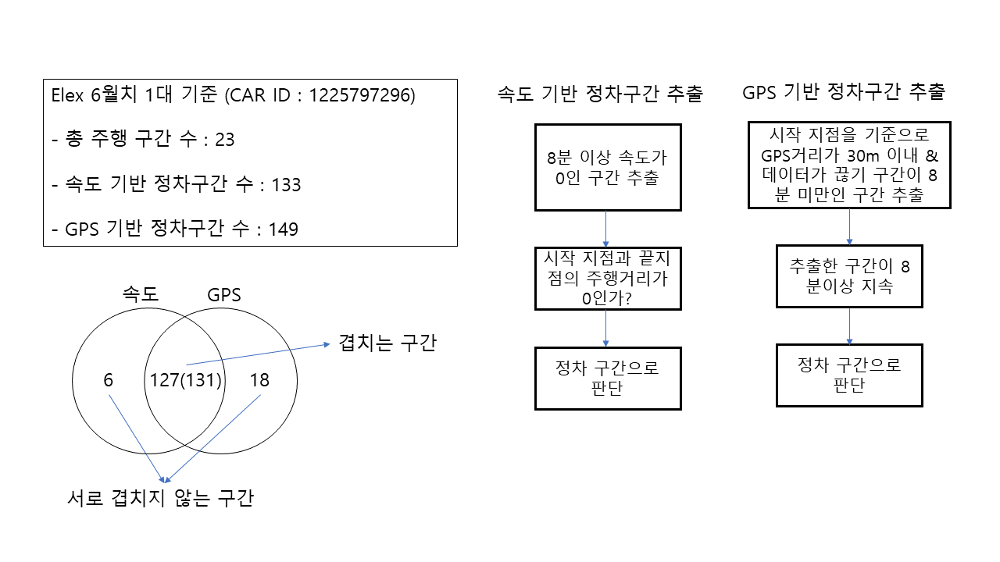
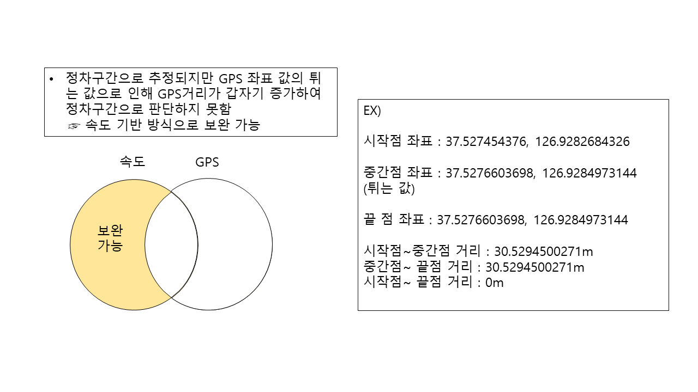
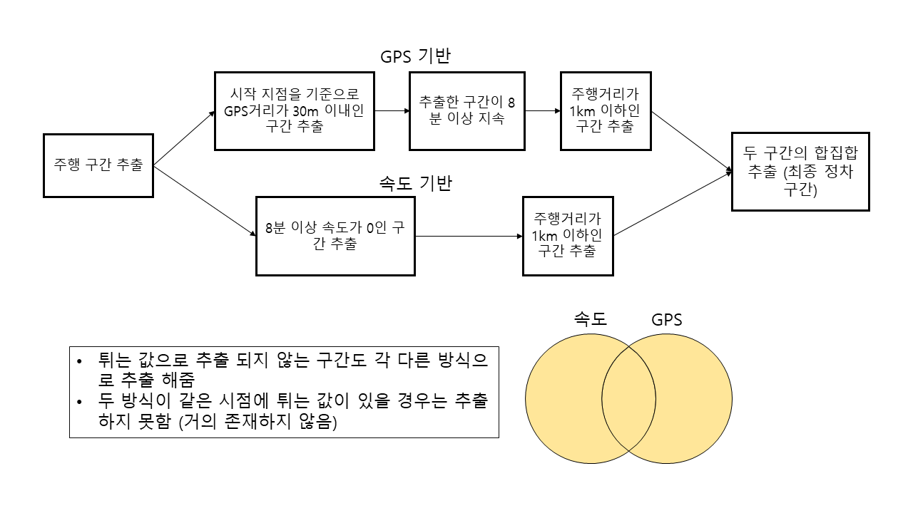
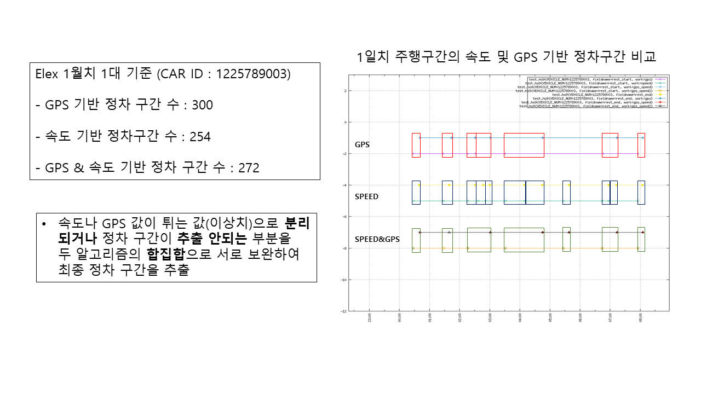

## 속도, GPS 기반 정차 구간 추출

-  기존 속도 기반 정차 구간과 GSP 기반 정차 구간 비교

  

-  속도 기반 정차 구간 추출 방식의 한계

  

-  GPS 기반 정차 구간 추출 방식의 한계

  

-  속도 기반 및 GPS 기반으로 추출한 정차 구간의 합집합으로 최종 정차 구간 추출

  

- 속도, GPS , 속도&GPS 기반 정차 구간 알고리즘 비교 및 결과

  