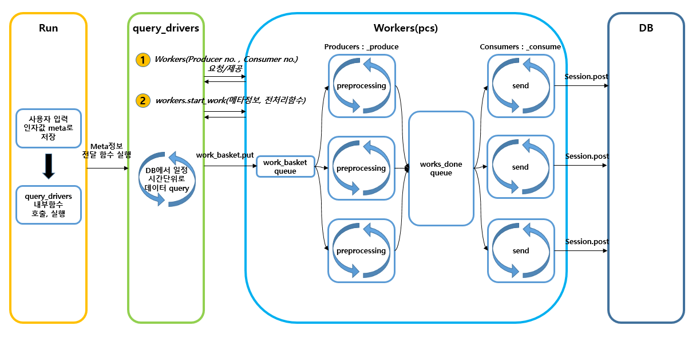
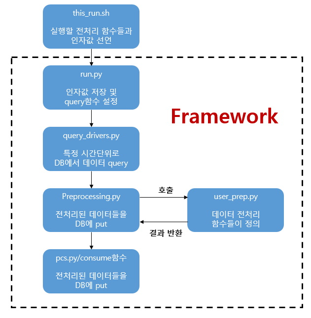

# ◎ apps refactoring을 위한 핵심 사용파일 및 사용함수 정리

  ## ○ 코드 작동 순서
  
  - 흐름도

    

  - 블록도

    

  ### ● apps/

  - apps_ver_01/otsdb_*/
    - this_run.sh

        : 사용자 입력 인자값들이 정의된 파일

                # read 할 open tsdb 정보
                url_in ( query할 opentsdb url )
                port_in ( query할 opentsdb port )
                metric_in ( query할 opentsdb metric )

                # write 할 open tsdb 정보
                url_out ( put할 opentsdb url )
                port_out ( put할 opentsdb port )
                metric_out ( put할 opentsdb metric )

                time_start ( 쿼리 시작시간 )
                time_end ( 쿼리 종료시간 )

                seconds ( 전처리 함수에서 사용할 시간정보(초) )

                tag ( 쿼리할 태그 )
                agg ( 쿼리할 때 aggregate )
                id ( 예전버전에 사용했었지만 필요없는 변수, 삭제예정 )

                # import 할 파일 이름, ./user_prep.py
                file ( 전처리 함수가 정의되어있는 파일 )

                # 생성할 프로세서 갯수. Producer, Consumer
                pn (producer 프로세서 개수)
                cn (consumer 프로세서 개수)

                # read 단위를 결정, d 하루단위 tsdb read, h 시간단위, m 분단위
                timeunit (한번에 query할 시간단위)
                timelong (한번에 query할 시간)

                # 인자값 17개 run.py에 전달
                ## time 은 스크립트 SW 실행 시간을 확인하기 위해 사용 
                time python run.py $url_in $port_in $metric_in $url_out $port_out $metric_out $time_start $time_end $seconds $tag $agg $id $file $pn $cn $timeunit $timelong

    - run.py

        - 사용자 정의 모듈 경로 정의

                sys.path.append("../../../lib/preprocessing")
                sys.path.append('../../../lib/multi_proc')
                sys.path.append('../../../lib/opentsdb')
                sys.path.append('../../../lib/log')
                sys.path.append('../../../lib')

        - def brush_args():
            
            : this_run.sh에 정의된 사용자 입력 인자값을 읽는 함수

        - if \_\_name__ == "\_\_main__":

            : brush_args()에서 받은 인자값들을 변수에 저장하고 meta딕셔너리에 저장하고 lib/query_drivers에 정의된 함수 실행

    - user_prep.py

        : 사용자가 실행할 전처리함수 작성

  ### ● lib/
  
  - multi_proc/

    - keti_multiprocessing.py

    - pcs.py

  - opentsdb/

    - HTTP_POST_request.py

      - def convertTimeToEpoch():

      - def _processingResponse():

      - def query_by_timedelta():

      - def query_by_non_repetitive_time():

      - def QueryData():

    - query_drivers.py

      - def calc():

      - def query_nto_tsdb():
        : 지정 시간단위씩 쿼리를 요청하고 리턴되는 결과데이터를 전처리함수로 전달

      - def query_nto_tsdb_v2():
        : 지정 시간단위로 쿼리를 나누는 것이 아니라 차량 ID별로 쿼리를 요청하고 리턴되는 결과데이터를 전처리함수로 전달

      - def query_nto_tsdb_v3():
        : (data stop start metric을 만드는데 사용) 차 ID마다 데이터 총 기간의 stop과 start가 기록된 csv파일을 읽어 각 딕셔너리의 stop timestamp ~ start timestamp 범위로 tsdb에서 쿼리를 요청하고 리턴되는 결과데이터를 전처리함수로 전달

      - def query_to_getids():
        : openTSDB에서 쿼리기간동안 사용자가 지정한 시간단위씩 요청을 하여 리턴되는 결과값의 차번호들을 리스트로 만들고 각 차번호마다 존재 데이터포인트 개수와 존재 비율을 각각 딕셔너리로 하여 결과값 반환

  - preprocessing/
    
    - Preprocessing.py
      
      - def prep():

      - def _putIteration():

      - def convertTimeToEpoch():

  - Utils.py
