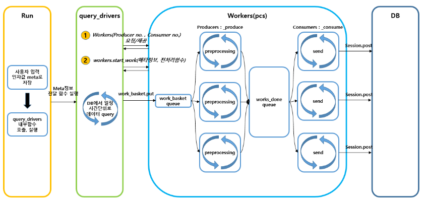
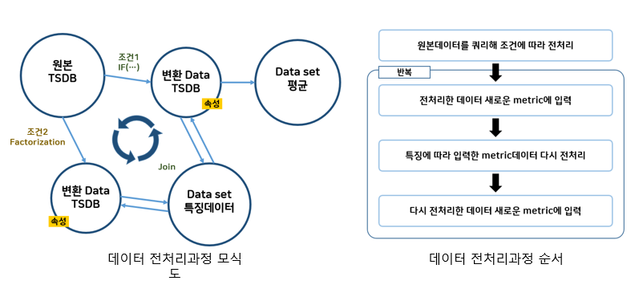

# Driving Preprocessing

### ● 01_MongoDBtoCSVFiles
  - MongoDB에서 데이터를 쿼리요청해 리턴되는 결과를 CSV파일로 저장
    
### ● 02_CSVJSON
  - 실행시 csv field(column) 목록을 보여주고 사용자로 부터 처리할 필드명을 입력받은 후 
  - JSON 파일에서 수정할 문자열과 수정된 후의 문자열을 입력받고 
  - OpenTSDB에 입력할 수 있는 JSON 형식으로 변환, 변환된 JSON 파일을 수정

### ● 03_rmOutlier
  - 2_CSVJSON으로 만들어진 원본 JSON파일을 읽어 이상치 데이터를 제거하고 새로운 JSON파일을 만듦

### ● 04_JsonGraph
  - 사용자가 입력한 두개 차량의 fieldname을 비교하기위한 그래프를 보여줌
  
### ● 05_JsonToTSDB
  - CSVJSON 코드 실행 결과로 생성된 Json을 DataBase로 입력

### ● 06_ViewData
  - openTSDB의 그래프를 이미지 파일로 저장

### ● 07_OpenTSDB_Apps
  - 데이터 처리 및 특징 추출을 위한 병렬 처리 시스템

### ● 08_TSDBtoExcel
  - 분석한 최종 데이터를 시간 당 이동거리를 계산한 후 Excel파일로 저장 후 모든 차량의 장/단거리 판단 결과를 출력해줌
  
### ● MongoToTSDB
  - MongoDB에서 데이터를 쿼리요청해 리턴되는 결과를 openTSDB로 put

### ● EXCELtoCSV
  - 현재 디렉토리와 서브디렉토리를 탐색하여 모든 xlsx파일을 모은 후 csv파일로 변환해주는 코드

### ● multi_put
  - JsonToTSDB의 put기능에 multi processing 적용한것
    
----

## 데이터 전처리 과정

  - data put system
    - OpenTSDB에 저장된 데이터를 query하여 원하는 형태의 Data Point로 변환하여 다시 OpenTSDB에 입력
    - 원하는 데이터 형태에 따른 데이터 형태로 전처리 하여 데이터 입력
    - 멀티 프로세싱 사용과 비동기적인 각 프로세스 동작으로 데이터 처리 고속화
    -  </img>  

    - 단순히 전처리 작업 및 간단한 드라이버 함수만 작성하면 되는 프레임워크
    - 작업 목록을 읽어서 생산자(데이터 전처리 작업 수행 프로세스)에게 처리 해야 할 작업 내용 전달, 생산자가 처리한 작업 내용들은 소비자에게 전달되어 소비자가 작업 내용을 DB로 전송
    
  - Unit 단위의 metric 쿼리, 데이터 전처리 작업, DB에 데이터 입력
    - openTSDB에 저장된 단위 메트릭 여러 개를 query하여 원하는 전처리 함수 실행 후 openTSDB의 새로운 메트릭에 저장하는 구조
    -  </img>  

    
